# Agentic Startup Studio - System Architecture v2.0

## Executive Summary

The Agentic Startup Studio implements a production-ready, event-driven microservices architecture for automated startup idea validation and market testing. Built with comprehensive SDLC automation, the system processes ideas through a secure, cost-controlled pipeline from conception to deployment with full observability and quality gates.

## Architecture Principles

### 🏗️ Design Principles
- **Security-First**: Zero-trust architecture with comprehensive authentication and audit logging
- **Event-Driven**: Asynchronous processing with domain events and circuit breakers
- **AI-Centric**: Multi-agent coordination through LangGraph state management
- **Cost-Controlled**: Real-time budget monitoring with automated enforcement
- **Production-Ready**: 99% uptime with automatic recovery and observability

### 📊 Quality Attributes
| Attribute | Target | Implementation |
|-----------|--------|----------------|
| **Performance** | <50ms vector search, <200ms API responses | HNSW indexing, connection pooling |
| **Reliability** | 99% uptime, automatic recovery | Circuit breakers, health checks, retries |
| **Security** | Zero vulnerabilities, comprehensive auditing | JWT auth, rate limiting, secrets management |
| **Cost Efficiency** | $62/cycle budget control | Real-time monitoring, automated limits |
| **Scalability** | 10x throughput without changes | Async processing, microservices |

## System Context

## Container Architecture

### Core Services

| Service | Technology | Purpose | Dependencies |
|---------|------------|---------|--------------|
| **API Gateway** | FastAPI + JWT | Secure authenticated access | PostgreSQL, Redis |
| **Processing Pipeline** | Python + LangGraph | Async idea processing | All external APIs |
| **Vector Search** | PostgreSQL + pgvector | Similarity and duplicate detection | PostgreSQL |
| **AI Agents** | LangChain + CrewAI | Evidence collection, pitch generation | OpenAI, Google AI |
| **Budget Sentinel** | Python | Real-time cost monitoring | All paid services |
| **Observability** | Prometheus + Grafana | Metrics, tracing, alerting | All services |

### Data Flow Architecture

```mermaid
flowchart TD
    Input[Idea Input] --> Validate[🔍 Validation Engine]
    Validate --> Duplicate[🔄 Duplicate Detection]
    Duplicate --> Store[💾 Storage Layer]
    Store --> Process[⚡ Pipeline Processing]
    
    Process --> Research[🔬 Evidence Collection]
    Research --> Analysis[📊 Market Analysis]
    Analysis --> Deck[📋 Pitch Generation]
    Deck --> Test[🧪 Smoke Testing]
    Test --> Deploy[🚀 Deployment]
    
    subgraph "Quality Gates"
        QG1[Validation Gate]
        QG2[Research Gate]
        QG3[Deck Gate]
        QG4[Test Gate]
    end
    
    Validate --> QG1
    Research --> QG2
    Deck --> QG3
    Test --> QG4
```

## Security Architecture

### Defense-in-Depth

### Security Controls

| Layer | Control | Implementation | Status |
|-------|---------|----------------|--------|
| **Network** | TLS encryption | HTTPS/WSS only | ✅ |
| **API** | JWT authentication | Token-based auth | ✅ |
| **Application** | Input validation | Pydantic schemas | ✅ |
| **Data** | Secrets management | Google Cloud Secret Manager | ✅ |
| **Code** | Security scanning | Bandit, detect-secrets | ✅ |
| **Dependencies** | Vulnerability scanning | Safety, audit tools | ✅ |

## Deployment Architecture

### Production Environment

### Container Strategy

| Component | Base Image | Security | Health Checks |
|-----------|------------|----------|---------------|
| **API Gateway** | python:3.11-slim | Non-root user, minimal packages | /health endpoint |
| **Pipeline Worker** | python:3.11-slim | Secrets via volume mounts | /metrics endpoint |
| **PostgreSQL** | postgres:15-alpine | Custom config, encrypted storage | pg_isready |
| **Redis** | redis:7-alpine | Auth enabled, persistence | redis-cli ping |

## Data Architecture

### Data Model

### Storage Strategy

| Data Type | Storage | Backup | Retention |
|-----------|---------|--------|-----------|
| **Ideas** | PostgreSQL | Daily automated | 7 years |
| **Research** | PostgreSQL | Daily automated | 2 years |
| **Vectors** | pgvector | Daily automated | 7 years |
| **Analytics** | JSON files | Weekly automated | 1 year |
| **Logs** | Structured logs | Daily automated | 90 days |

## Operational Architecture

### Monitoring & Observability

| Metric Type | Tool | Purpose | Alerts |
|-------------|------|---------|--------|
| **Application** | Prometheus | Performance, errors | Response time >200ms |
| **Infrastructure** | Grafana | Resource utilization | CPU >80%, Memory >85% |
| **Business** | Custom dashboards | Pipeline throughput | Ideas/hour <1 |
| **Security** | Audit logs | Access patterns | Failed auth >10/min |

### Quality Gates

### Performance Targets

| Metric | Target | Measurement |
|--------|--------|-------------|
| **API Response Time** | <200ms p95 | Prometheus metrics |
| **Vector Search** | <50ms p95 | Database monitoring |
| **Pipeline Completion** | <4 hours | End-to-end tracking |
| **Uptime** | 99.9% | Health check monitoring |
| **Error Rate** | <0.1% | Application logs |

## Technology Stack

### Core Technologies

| Layer | Technology | Version | Purpose |
|-------|------------|---------|---------|
| **Runtime** | Python | 3.11+ | Primary language |
| **Framework** | FastAPI | 0.104+ | API development |
| **Database** | PostgreSQL | 15+ | Primary data store |
| **Vector DB** | pgvector | 0.2.3+ | Similarity search |
| **AI Framework** | LangChain | 0.2+ | AI orchestration |
| **State Management** | LangGraph | 0.0.32+ | Workflow coordination |

### Infrastructure

| Component | Technology | Purpose |
|-----------|------------|---------|
| **Containerization** | Docker | Application packaging |
| **Orchestration** | Docker Compose | Local development |
| **Load Balancing** | Nginx | Traffic distribution |
| **Monitoring** | Prometheus + Grafana | Observability |
| **Secrets** | Google Secret Manager | Secure configuration |

## Development Architecture

### SDLC Integration

| Phase | Tools | Automation |
|-------|-------|------------|
| **Code Quality** | Ruff, mypy, pre-commit | Automated formatting, linting |
| **Testing** | pytest, coverage | 90% coverage requirement |
| **Security** | Bandit, detect-secrets | Vulnerability scanning |
| **Build** | Docker, semantic-release | Automated versioning |
| **Deploy** | GitHub Actions | CI/CD pipelines |

### Development Workflow

## Architecture Decision Records

Key architectural decisions are documented in `/docs/adr/`:

- [ADR-001](docs/adr/001-microservices-architecture.md): Microservices vs Monolith
- [ADR-002](docs/adr/002-vector-database-choice.md): pgvector vs Dedicated Vector DB
- [ADR-003](docs/adr/003-ai-framework-selection.md): LangChain + LangGraph
- [ADR-004](docs/adr/004-authentication-strategy.md): JWT-based Authentication
- [ADR-005](docs/adr/005-observability-stack.md): Prometheus + Grafana

## Future Considerations

### Scalability Roadmap

| Phase | Trigger | Solution |
|-------|---------|----------|
| **Phase 1** | >100 ideas/day | Horizontal scaling |
| **Phase 2** | >1000 ideas/day | Service mesh (Istio) |
| **Phase 3** | Multi-region | Global distribution |

### Technology Evolution

- **AI Models**: Transition to specialized models for domain tasks
- **Storage**: Consider distributed vector databases at scale
- **Compute**: GPU acceleration for AI workloads
- **Networking**: Service mesh for microservices communication

---

*Last updated: 2025-07-27*  
*Next review: 2025-10-27*