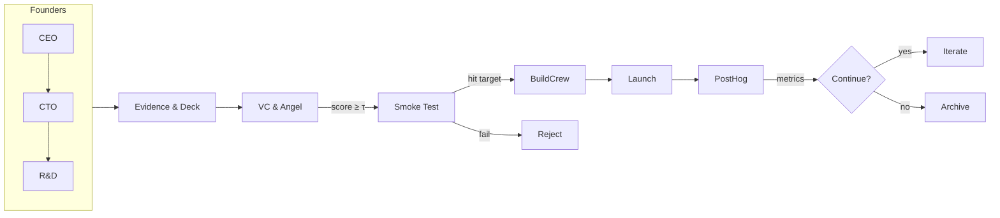

# Agentic Startup Studio – **Founder × Investor Edition**

> **Mission:** Harvest *fundable* startup opportunities—not just ideas—by simulating a founder trio (CEO + CTO + VP R&D) that must win over virtual VC & angel agents before any code is shipped.

---

## Why This Variant?

1.  **Higher signal-to-noise.** Only the ~5 % of ideas that pass a multi-model investor gate enter your build queue—cutting compute burn and engineer churn.
2.  **Evidence-backed pitches.** Founder agents must attach verifiable sources (URLs, datasets) to every market claim.
3.  **Real-world smoke tests.** Accepted ideas auto-launch a fake-door landing page + $50 ad spend to collect email sign-ups before green-light.

Industry studies show LLM-generated ideas are novel but often infeasible ([arxiv.org](https://arxiv.org/html/2409.04109v1?utm_source=chatgpt.com)). By adding cross-model investor critics and smoke tests, we raise feasibility without stifling creativity.

---

## Table of Contents

1.  Key Features
2.  Architecture
3.  Quick Start
4.  Experiment Lifecycle
5.  Safety & Risk Controls
6.  Repository Layout
7.  Roadmap
8.  License

---

## 1. Key Features

| Phase                  | Agents & Tools                                                                                                                | Outcome                         |
| ---------------------- | ----------------------------------------------------------------------------------------------------------------------------- | ------------------------------- |
| **Ideation**           | MetaGPT Founder Crew (CEO / CTO / VP R&D) ([github.com](https://github.com/FoundationAgents/MetaGPT?utm_source=chatgpt.com)) | Draft specs, SWOT, TAM sheet    |
| **Evidence Gathering** | AutoGPT w/ Browser + RAG; sources stored in `docs/`                                                                           | Citations & datasets            |
| **Pitch Loop**         | Slide-builder (Marp) → VC & Angel agents (CrewAI)                                                                             | Funding score (0-1)             |
| **Smoke Test**         | Static Next.js page + Unbounce + $50 Google Ads                                                                              | True demand KPI (CTR, signup %) |
| **MVP Build**          | GPT-Engineer + OpenDevin                                                                                                      | Tested repo & CI                |
| **Launch & Growth**    | SuperAGI GTM + Social-GPT + Dittofeed                                                                                         | Paid & organic acquisition      |
| **Analytics**          | PostHog dashboards                                                                                                            | KPI feed to decision gate       |

---

## 2. System Architecture



*Investor agents run on **Gemini 2.5 Pro**, founders on **GPT-4o** to avoid same-model echo chambers ([arxiv.org](https://arxiv.org/abs/2501.14844?utm_source=chatgpt.com)).*

---

## 3. Quick Start

```bash
# clone & spin core stack
make bootstrap           # docker compose: redis, pgvector, posthog, dittofeed

# run a single founder→investor cycle with 20k token cap
make pitch-loop MAX_TOKENS=20000 FUND_THRESHOLD=0.8

# review smoke-test results in PostHog, then trigger build
make build-cycle IDEA_ID=<uuid>
```

---

## 4. Experiment Lifecycle

1.  **Founder Brainstorm** – 3-agent debate → top-3 specs.
2.  **Auto-Research** – browser/search tasks populate a YAML brief with citations.
3.  **Deck Generation** – Marp Markdown slide deck saved to `pitches/`.
4.  **Investor Review** – VC & Angel agents assign *FundingScore* (0-1) using DeckMatch heuristics ([deckmatch.com](https://www.deckmatch.com/?utm_source=chatgpt.com)).
5.  **Smoke Test** – if score ≥ τ, deploy landing page & ads; require ≥ 100 clicks & 5 % signup (Brightscout EVT method ([linkedin.com](https://www.linkedin.com/pulse/building-smoke-test-validate-your-business-ideas-quickly-haggas-lbn4e?utm_source=chatgpt.com))).
6.  **Build / Launch** – same as classic studio.
7.  **Archive or Scale** – KPI gate decides.

---

## 5. Safety & Risk Controls

*   **Source Enforcement** – ‘EvidenceCollector’ agent rejects claims lacking 3 citations; mitigates hallucinations ([arxiv.org](https://arxiv.org/pdf/2410.20024?utm_source=chatgpt.com)).
*   **Cross-model Ensemble** – founders vs. investors on different LLM families; ensemble critics reduce bias ([arxiv.org](https://arxiv.org/html/2404.02650v1?utm_source=chatgpt.com)).
*   **Cost Cap** – token & ad budget per pitch. GPT-4o pricing: $12 / 1M output tokens ([openai.com](https://openai.com/api/pricing/?utm_source=chatgpt.com)).
*   **Agbenchmark** before deploy ([github.com](https://github.com/Significant-Gravitas/Auto-GPT-Benchmarks?utm_source=chatgpt.com)).
*   **Human Oversight** – optional manual veto after smoke test.

---

## 6. Repository Layout (delta)

```
agents/
  founders/{ceo,cto,vp_rd}.yaml
  investors/{vc,angel}.yaml
configs/langgraph/
  pitch_loop.py          # state machine
scripts/
  run_pitch.py
  run_smoke_test.py
pitches/
  <idea_id>/deck.marp
smoke_tests/
  <idea_id>/analytics.json
```

---

## 7. Roadmap

*   [ ] Fine-tune small local models for evidence summarisation
*   [ ] Investor-agent RL-HF on historical decks ([getpin.xyz](https://www.getpin.xyz/post/pitch-decks-of-ai-startups?utm_source=chatgpt.com))
*   [ ] Auto-allocation of bigger ad budget when CTR > target
*   [ ] GUI: React + shadcn dashboard for idea ledger.

---

## 8. License

Code MIT, content CC-BY-4.0.
