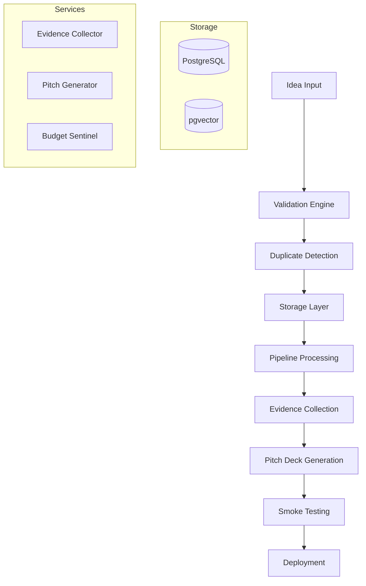

# Agentic Startup Studio – **Data Pipeline Edition**

> **Mission:** Systematically validate and process startup ideas through a comprehensive data pipeline with automated validation, testing, and evidence collection to maximize fundable opportunity discovery.

---

## Why This Approach?

1.  **Systematic Validation.** Multi-layered validation engine filters and enhances ideas through comprehensive checks including duplicate detection, similarity analysis, and evidence requirements.
2.  **Data-Driven Pipeline.** Structured ingestion, processing, and storage with full audit trails and progress tracking.
3.  **Comprehensive Testing.** Built-in testing framework ensures data quality and pipeline reliability at every stage.

This implementation focuses on robust data processing and validation infrastructure that can scale to handle large volumes of startup ideas while maintaining data quality and system reliability.

---

## Table of Contents

1.  [Key Features](#1-key-features)
2.  [Architecture](#2-pipeline-architecture)
3.  [Quick Start](#3-quick-start)
4.  [CLI Usage](#4-cli-usage)
5.  [Testing Framework](#5-testing-framework)
6.  [Configuration](#6-configuration)
7.  [Project Structure](#7-project-structure)
8.  [Development](#8-development)

---

## 1. Key Features

| Component | Technology | Purpose |
|-----------|------------|---------|
| **Data Ingestion** | Pydantic Models + Validation | Structured idea intake with comprehensive validation |
| **Pipeline Processing** | Python + AsyncIO | Multi-stage processing with progress tracking |
| **Storage Layer** | PostgreSQL + pgvector | Persistent storage with vector similarity search |
| **Validation Engine** | Custom Framework | Multi-layered validation with duplicate detection |
| **CLI Tools** | Click + Rich | User-friendly command-line interface |
| **Testing Framework** | pytest + Custom Validators | Comprehensive test coverage and validation |
| **Configuration** | Pydantic Settings | Environment-driven configuration management |
| **Services Integration** | Modular Architecture | Pitch deck generation, evidence collection, budget tracking |

---

## 2. Pipeline Architecture



### Pipeline Stages

| Stage | Status | Description | Outputs |
|-------|--------|-------------|---------|
| **IDEATE** | DRAFT | Initial idea conception and basic validation | Validated idea record |
| **RESEARCH** | RESEARCHING | Evidence collection and market research | Research data, citations |
| **DECK** | VALIDATING | Pitch deck generation and formatting | Pitch deck artifacts |
| **INVESTORS** | VALIDATED | Investor evaluation simulation | Funding scores |
| **MVP** | BUILDING | Minimum viable product development | MVP specifications |
| **SMOKE_TEST** | TESTING | Market validation testing | Performance metrics |
| **COMPLETE** | DEPLOYED | Full deployment and monitoring | Live product |

---

## 3. Quick Start

### Prerequisites

- Python 3.11+
- PostgreSQL 14+ with pgvector extension
- Git

### Installation

```bash
# Clone repository
git clone https://github.com/your-org/agentic-startup-studio.git
cd agentic-startup-studio

# Install dependencies
pip install -r requirements.txt

# Set up environment variables (copy and edit)
cp .env.example .env

# Run tests to verify setup
pytest
```

### Basic Usage

```bash
# Create a new startup idea
python -m pipeline.cli.ingestion_cli create \
  --title "AI-Powered Code Review Assistant" \
  --description "Automated code review tool that provides intelligent feedback on pull requests" \
  --category "ai_ml"

# List all ideas
python -m pipeline.cli.ingestion_cli list

# Get idea details
python -m pipeline.cli.ingestion_cli get --id <idea-uuid>

# Advance idea through pipeline stages
python -m pipeline.cli.ingestion_cli advance --id <idea-uuid> --stage RESEARCH
```

---

## 4. CLI Usage

The CLI provides comprehensive idea management capabilities:

### Creating Ideas

```bash
# Interactive creation
python -m pipeline.cli.ingestion_cli create

# With all parameters
python -m pipeline.cli.ingestion_cli create \
  --title "Your Idea Title" \
  --description "Detailed description" \
  --category "saas" \
  --problem "Problem statement" \
  --solution "Solution description" \
  --market "Target market" \
  --evidence "https://evidence1.com,https://evidence2.com"
```

### Filtering and Search

```bash
# Filter by status
python -m pipeline.cli.ingestion_cli list --status VALIDATED

# Filter by category
python -m pipeline.cli.ingestion_cli list --category fintech

# Search in titles and descriptions
python -m pipeline.cli.ingestion_cli list --search "AI machine learning"

# Combine filters
python -m pipeline.cli.ingestion_cli list --status RESEARCHING --category ai_ml --limit 10
```

### Managing Ideas

```bash
# Update idea fields
python -m pipeline.cli.ingestion_cli update <idea-uuid> \
  --title "Updated Title" \
  --description "Updated description"

# Find similar ideas
python -m pipeline.cli.ingestion_cli similar <idea-uuid> --limit 5

# System health check
python -m pipeline.cli.ingestion_cli health
```

---

## 5. Testing Framework

### Running Tests

```bash
# Run all tests
pytest

# Run with coverage
pytest --cov=pipeline --cov-report=html

# Run specific test categories
pytest tests/pipeline/models/        # Model tests
pytest tests/pipeline/ingestion/    # Ingestion tests
pytest tests/framework/             # Framework tests

# Run with verbose output
pytest -v
```

### Test Categories

| Category | Purpose | Coverage |
|----------|---------|----------|
| **Unit Tests** | Individual component testing | Models, validators, utilities |
| **Integration Tests** | Component interaction testing | Manager, repository, CLI |
| **Framework Tests** | Validation engine testing | Data flow, error handling |
| **E2E Tests** | Complete pipeline testing | Full workflow validation |

### Test Configuration

Tests use [`pytest.ini`](pytest.ini) for configuration and [`tests/conftest.py`](tests/conftest.py) for shared fixtures:

```python
# Available test fixtures
- test_db: In-memory database
- sample_idea: Valid idea instance
- idea_manager: Configured manager
- cli_runner: CLI test runner
```

---

## 6. Configuration

Configuration is managed through environment variables and Pydantic settings:

### Environment Variables

```bash
# Database Configuration
DB_HOST=localhost
DB_PORT=5432
DB_NAME=startup_studio
DB_USER=postgres
DB_PASSWORD=your_password

# Application Settings
ENVIRONMENT=development
LOG_LEVEL=INFO
SECRET_KEY=your-secret-key

# Validation Settings
SIMILARITY_THRESHOLD=0.8
MAX_IDEAS_PER_HOUR=10

# Budget Controls
TOTAL_CYCLE_BUDGET=62.00
OPENAI_BUDGET=10.00
GOOGLE_ADS_BUDGET=45.00
```

### Configuration Categories

| Category | Purpose | Key Settings |
|----------|---------|--------------|
| **Database** | PostgreSQL connection and pgvector | Host, credentials, pool settings |
| **Validation** | Input validation and security | Length limits, filters, thresholds |
| **Embedding** | Text embedding configuration | Provider, model, caching |
| **Logging** | Application logging | Levels, formats, destinations |
| **Budget** | Cost control and monitoring | Limits, thresholds, alerts |

---

## 7. Project Structure

```
agentic-startup-studio/
├── pipeline/                    # Core pipeline implementation
│   ├── cli/                    # Command-line interface
│   ├── config/                 # Configuration management
│   ├── ingestion/              # Data ingestion and validation
│   ├── models/                 # Data models and schemas
│   ├── services/               # Business logic services
│   └── storage/                # Data persistence layer
├── tests/                      # Comprehensive test suite
│   ├── framework/              # Testing framework
│   ├── pipeline/               # Pipeline component tests
│   └── integration/            # Integration tests
├── docs/                       # Documentation
│   ├── specs/                  # Technical specifications
│   └── sample-data/            # Sample data and examples
├── tools/                      # External tool integrations
├── scripts/                    # Utility scripts
└── requirements.txt            # Python dependencies
```

---

## 8. Development

### Development Setup

```bash
# Install development dependencies
pip install -r requirements.txt
pip install -e .

# Set up pre-commit hooks
pre-commit install

# Run development server
python -m pipeline.main_pipeline --debug
```

### Contributing

1. Fork the repository
2. Create a feature branch: `git checkout -b feature/new-feature`
3. Make changes and add tests
4. Run tests: `pytest`
5. Submit a pull request

### Code Quality

- **Linting**: Uses `ruff` for code formatting and linting
- **Type Checking**: Uses `mypy` for static type analysis
- **Testing**: Minimum 80% test coverage required
- **Documentation**: All public APIs must be documented

For detailed development guidelines, see [`docs/contributing-guide.md`](docs/).

---

## License

This project is licensed under the MIT License - see the [LICENSE](LICENSE) file for details.
