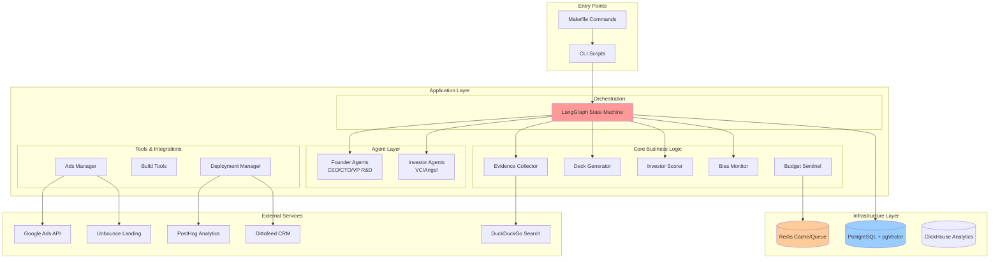
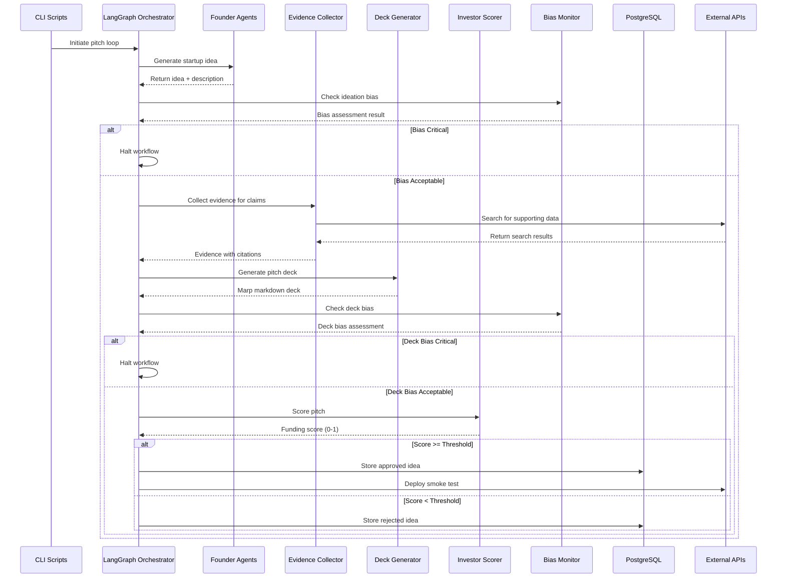
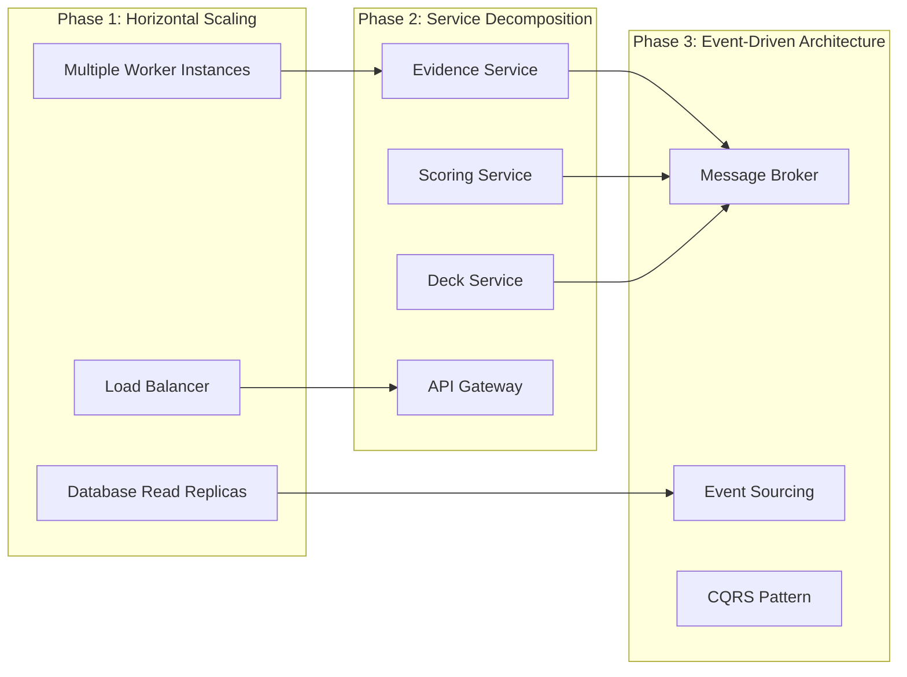
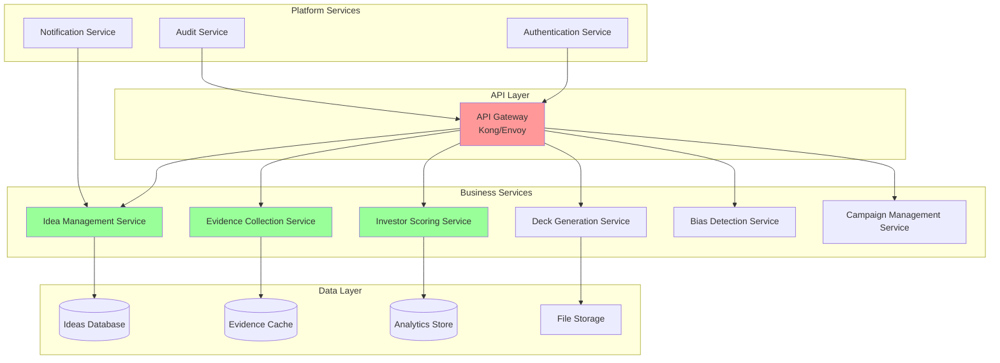
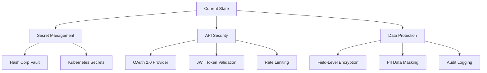
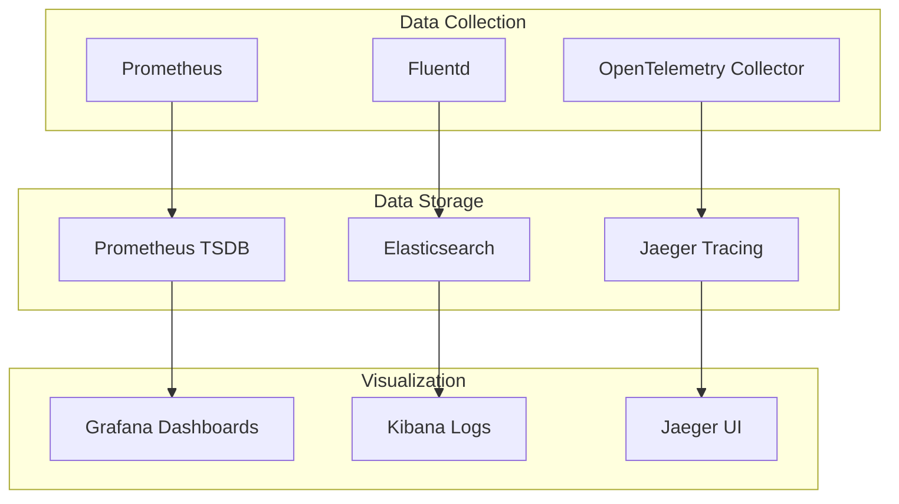
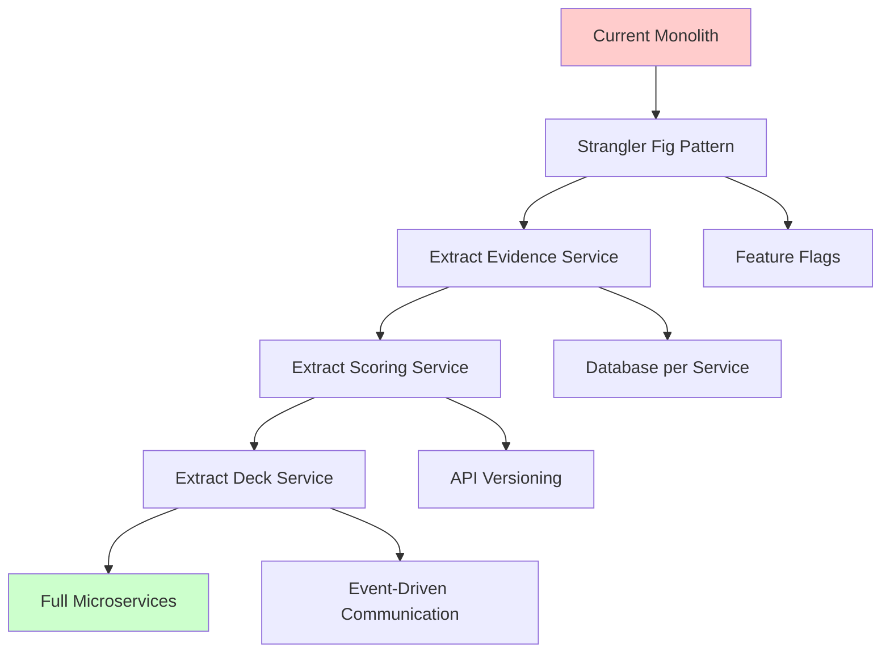

# Agentic Startup Studio - Comprehensive Architectural Analysis

## Executive Summary

The Agentic Startup Studio employs a sophisticated multi-agent architecture that simulates founder-investor dynamics through distinct AI models, evidence-based validation, and automated smoke testing. The system demonstrates strong modular design principles but exhibits opportunities for enhanced scalability, service boundaries, and integration patterns.

---

## 1. System Architecture Overview

### Current Architecture Pattern
- **Event-Driven Workflow**: LangGraph state machine orchestrates multi-phase validation
- **Multi-Model Ensemble**: GPT-4o for founders, Gemini 2.5 Pro for investors (anti-echo chamber)
- **Microservice-Ready**: Modular core components with clear responsibilities
- **External Integration Heavy**: Multiple third-party services for specialized functions

### High-Level System Diagram



---

## 2. Module Boundaries & Separation of Concerns

### Core Module Analysis

| Module | Responsibility | Coupling Level | Maintainability |
|--------|---------------|----------------|-----------------|
| **`core/evidence_collector.py`** | Evidence validation with citations | Low | ✅ Excellent |
| **`core/deck_generator.py`** | Marp slide deck generation | Low | ✅ Excellent |
| **`core/investor_scorer.py`** | YAML-driven scoring rubrics | Low | ✅ Excellent |
| **`core/bias_monitor.py`** | Content bias detection | Low | ✅ Excellent |
| **`core/idea_ledger.py`** | SQLModel-based persistence | Medium | ⚠️ Good |
| **`configs/langgraph/pitch_loop.py`** | Workflow orchestration | High | ❌ Needs refactoring |

### Service Boundary Violations Identified

1. **State Machine Tight Coupling**: [`pitch_loop.py`](configs/langgraph/pitch_loop.py:1) directly imports and instantiates core modules
2. **Mixed Infrastructure Concerns**: Database logic embedded within business logic
3. **Configuration Hardcoding**: Environment variables scattered across modules
4. **Cross-cutting Concerns**: Alert management pattern inconsistently applied

---

## 3. Detailed Data Flow Analysis

### Pitch Loop Workflow Sequence



---

## 4. Technology Stack Evaluation

### Current Stack Assessment

| Layer | Technology | Strength | Weakness | Recommendation |
|-------|------------|----------|----------|----------------|
| **Orchestration** | LangGraph | ✅ Powerful state management | ❌ Vendor lock-in | Consider OpenTelemetry traces |
| **Database** | PostgreSQL + pgVector | ✅ Mature, vector support | ⚠️ Single point of failure | Add read replicas |
| **Cache/Queue** | Redis | ✅ Battle-tested | ⚠️ Not clustered | Consider Redis Cluster |
| **Analytics** | PostHog + ClickHouse | ✅ Real-time insights | ❌ Complex setup | Simplify with managed service |
| **LLM Integration** | Multiple providers | ✅ Avoids vendor lock-in | ❌ Complex credential management | Standardize via LiteLLM |
| **Infrastructure** | Docker Compose | ✅ Easy development | ❌ Not production-ready | Migrate to Kubernetes |

### Infrastructure Concerns Identified

1. **Docker Compose Duplication**: Lines 1-55 and 56-119 in [`docker-compose.yml`](docker-compose.yml:1) contain duplicate service definitions
2. **Hardcoded Secrets**: Database passwords in plaintext
3. **Single Point of Failure**: No redundancy for critical services
4. **Resource Limits**: No container resource constraints defined

---

## 5. Scalability Assessment

### Current Limitations

| Dimension | Current State | Bottleneck | Impact |
|-----------|---------------|------------|---------|
| **Throughput** | Single pitch loop execution | Sequential processing | High |
| **Concurrency** | No parallel idea processing | State machine design | High |
| **Storage** | Single PostgreSQL instance | Disk I/O limitations | Medium |
| **Memory** | No memory pooling | LLM model loading | Medium |
| **Network** | Synchronous API calls | External service latency | High |

### Scalability Improvement Roadmap



---

## 6. Service Boundary Redesign Recommendations

### Proposed Microservice Architecture



### Service Interface Contracts

#### Evidence Collection Service API
```yaml
# evidence-service-api.yaml
openapi: 3.0.0
info:
  title: Evidence Collection Service
  version: 1.0.0
paths:
  /evidence/collect:
    post:
      requestBody:
        content:
          application/json:
            schema:
              type: object
              properties:
                claim: {type: string}
                min_citations: {type: integer, default: 3}
                timeout_seconds: {type: integer, default: 30}
      responses:
        200:
          content:
            application/json:
              schema:
                type: object
                properties:
                  status: {type: string}
                  citations: {type: array}
                  confidence_score: {type: number}
```

---

## 7. Integration Points Analysis

### External Service Dependencies

| Service | Purpose | Criticality | Failure Mode | Mitigation |
|---------|---------|-------------|--------------|------------|
| **Google Ads API** | Campaign deployment | High | Circuit breaker needed | Fallback to manual |
| **DuckDuckGo Search** | Evidence collection | High | Timeout handling exists | Add retry logic |
| **PostHog** | Analytics tracking | Medium | Fire-and-forget | Queue events |
| **Dittofeed** | Email automation | Low | Async processing | Background jobs |
| **Unbounce** | Landing page hosting | High | Manual fallback needed | Static hosting backup |

### Integration Pattern Improvements

1. **Circuit Breaker Pattern**: Implement for all external APIs
2. **Retry with Exponential Backoff**: Standardize across all integrations
3. **Bulkhead Isolation**: Separate thread pools for different service types
4. **Health Check Endpoints**: Monitor service availability

---

## 8. Security & Privacy Assessment

### Current Security Posture

| Domain | Current State | Risk Level | Recommendation |
|--------|---------------|------------|----------------|
| **Secret Management** | Environment variables | ❌ High | Implement HashiCorp Vault |
| **API Authentication** | Basic auth/API keys | ⚠️ Medium | OAuth 2.0 + JWT |
| **Data Encryption** | Database encryption | ✅ Low | Add field-level encryption |
| **Network Security** | No TLS termination | ❌ High | Implement mTLS |
| **Input Validation** | Basic validation | ⚠️ Medium | Comprehensive schema validation |

### Security Improvement Plan



---

## 9. Performance & Monitoring

### Current Observability Gaps

1. **Missing Distributed Tracing**: No correlation between services
2. **Limited Metrics**: Basic health checks only
3. **Log Aggregation**: Scattered across containers
4. **Performance Profiling**: No APM tooling

### Recommended Monitoring Stack



---

## 10. Architectural Improvement Recommendations

### Priority Matrix: Value vs Effort

| Improvement | Value | Effort | Priority | Timeline |
|-------------|-------|--------|----------|----------|
| **Fix Docker Compose duplication** | Medium | Low | 🟢 P0 | 1 week |
| **Implement circuit breakers** | High | Medium | 🟡 P1 | 3 weeks |
| **Add distributed tracing** | High | Medium | 🟡 P1 | 4 weeks |
| **Extract scoring service** | High | High | 🟠 P2 | 8 weeks |
| **Implement secret management** | High | High | 🟠 P2 | 6 weeks |
| **Add horizontal scaling** | Very High | Very High | 🔴 P3 | 12 weeks |
| **Microservice decomposition** | Very High | Very High | 🔴 P3 | 16 weeks |

### Phase 1: Foundation Fixes (Weeks 1-4)

1. **Infrastructure Cleanup**
   - Remove Docker Compose duplication
   - Add resource limits and health checks
   - Implement proper secret management

2. **Reliability Improvements**
   - Add circuit breakers for external APIs
   - Implement retry logic with exponential backoff
   - Create comprehensive error handling

3. **Observability Foundation**
   - Integrate OpenTelemetry tracing
   - Set up Prometheus metrics collection
   - Implement structured logging

### Phase 2: Service Boundaries (Weeks 5-12)

1. **Extract Core Services**
   - Evidence Collection Service
   - Investor Scoring Service
   - Deck Generation Service

2. **API Gateway Implementation**
   - Kong or Envoy proxy
   - Rate limiting and authentication
   - Request/response validation

3. **Data Layer Optimization**
   - Database read replicas
   - Redis clustering
   - Backup and recovery procedures

### Phase 3: Scalability & Advanced Features (Weeks 13-20)

1. **Horizontal Scaling**
   - Kubernetes migration
   - Auto-scaling policies
   - Load balancing strategies

2. **Event-Driven Architecture**
   - Message broker integration
   - Event sourcing patterns
   - CQRS implementation

3. **Advanced Monitoring**
   - APM integration
   - Custom business metrics
   - Alerting and on-call procedures

---

## 11. Migration Strategy

### Risk Mitigation Approach



### Success Metrics

| Metric | Current | Target | Timeline |
|--------|---------|--------|----------|
| **Pitch Loop Throughput** | 1 idea/hour | 10 ideas/hour | 12 weeks |
| **System Availability** | 95% | 99.9% | 16 weeks |
| **Mean Time to Recovery** | 2 hours | 15 minutes | 8 weeks |
| **API Response Time** | 5-30 seconds | <2 seconds | 6 weeks |
| **Development Velocity** | 1 feature/sprint | 3 features/sprint | 20 weeks |

---

## 12. Conclusion

The Agentic Startup Studio demonstrates sophisticated architectural thinking with its multi-agent approach and evidence-based validation. The current modular design provides a strong foundation for scaling, but requires strategic refactoring to achieve production-grade reliability and performance.

### Key Architectural Strengths
- ✅ Clear separation of concerns in core modules
- ✅ Multi-model ensemble avoiding echo chambers  
- ✅ Evidence-based validation reducing hallucinations
- ✅ Comprehensive testing framework

### Critical Improvement Areas
- 🔧 Service boundary definition and API contracts
- 🔧 Infrastructure reliability and secret management
- 🔧 Horizontal scalability and load distribution
- 🔧 Observability and performance monitoring

The recommended 20-week migration path balances technical debt reduction with feature velocity, ensuring the system can scale to support hundreds of concurrent idea evaluations while maintaining the innovative multi-agent validation approach.

---

*Generated by Roo Architect - Comprehensive System Analysis*
*Last Updated: $(date)*