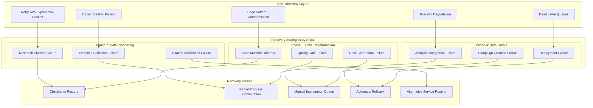
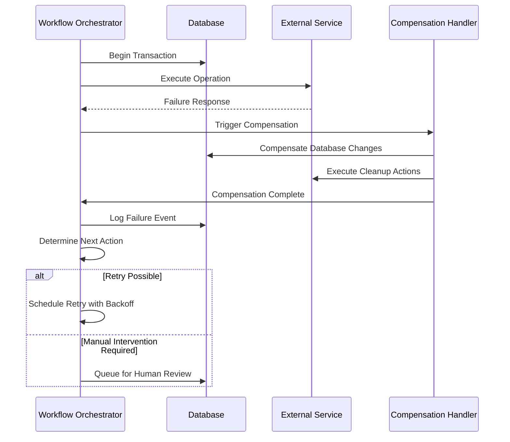
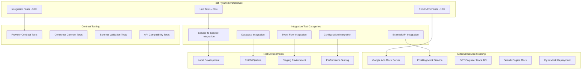
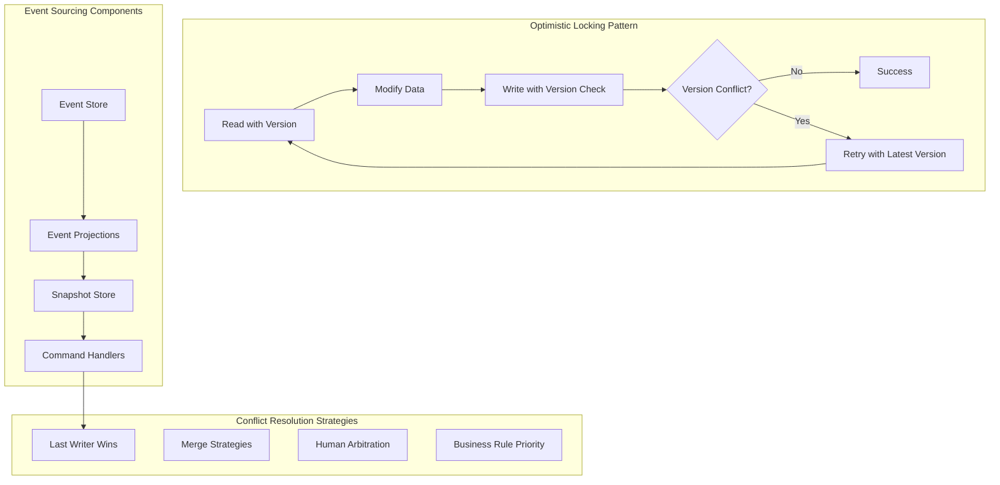
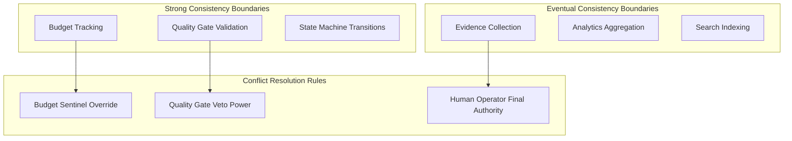
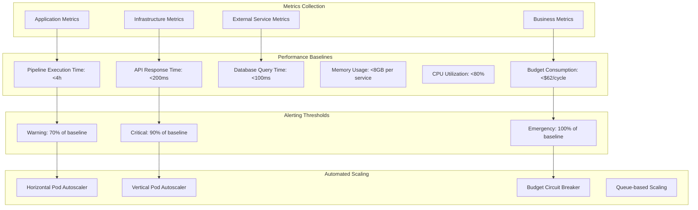
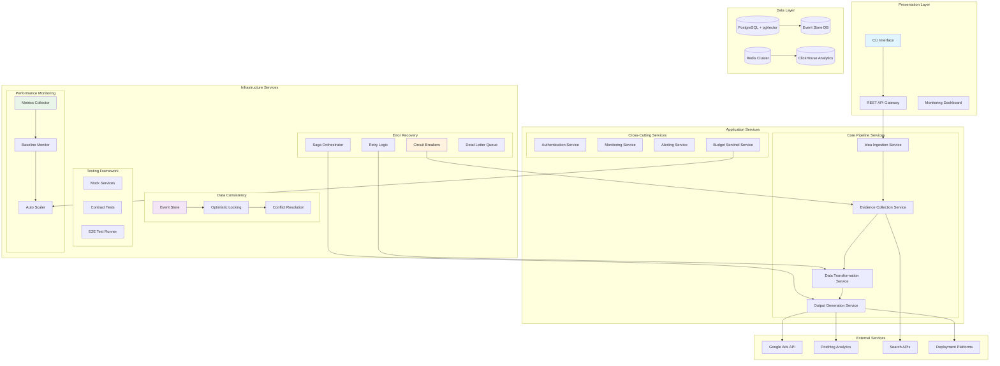

# Architecture Refinement: Critical Gap Resolution
## Agentic Startup Studio Data Pipeline

### Executive Summary

This document provides architectural solutions for the 4 critical gaps identified in the comprehensive data pipeline specification. Each solution maintains the ≤$62/cycle budget, <4 hour pipeline execution, and >90% test coverage constraints while ensuring extensible, modular design.

---

## 1. Error Recovery Architecture

### 1.1 Comprehensive Error Recovery Patterns



### 1.2 Phase-Specific Recovery Mechanisms

#### **Phase 2: Data Processing Recovery**
```yaml
evidence_collection_recovery:
  circuit_breaker:
    failure_threshold: 3
    timeout: 30s
    half_open_max_calls: 2
  retry_policy:
    max_attempts: 3
    backoff_strategy: exponential
    base_delay: 1s
    max_delay: 30s
  fallback_strategies:
    - alternative_search_engines: [bing, searx, duckduckgo]
    - cached_evidence_reuse: true
    - partial_evidence_acceptance: 
        min_citations: 2
        confidence_threshold: 0.6
  compensation_actions:
    - mark_evidence_incomplete: true
    - schedule_background_retry: true
    - alert_human_reviewer: true
```

#### **Phase 3: Data Transformation Recovery**
```yaml
deck_generation_recovery:
  saga_pattern:
    compensation_steps:
      - revert_state_transition
      - cleanup_partial_artifacts
      - restore_previous_checkpoint
  timeout_handling:
    deck_generation: 120s
    quality_gate_validation: 60s
    fallback_template: minimal_deck.marp
  rollback_triggers:
    - marp_syntax_error
    - accessibility_score_below_threshold
    - content_completeness_failure
```

#### **Phase 4: Data Output Recovery**
```yaml
deployment_recovery:
  rollback_mechanisms:
    google_ads_campaign:
      - pause_campaign_on_budget_breach
      - revert_ad_group_changes
      - restore_previous_keywords
    mvp_deployment:
      - fly_io_rollback_deployment
      - restore_previous_version
      - health_check_validation
  graceful_degradation:
    - static_landing_page_fallback
    - email_notification_instead_of_campaign
    - manual_deployment_queue
```

### 1.3 Compensation Transaction Patterns



---

## 2. Integration Testing Architecture

### 2.1 Comprehensive Testing Framework



### 2.2 End-to-End Pipeline Test Scenarios

```yaml
e2e_test_scenarios:
  happy_path:
    name: "Complete Pipeline Success"
    description: "Idea ingestion through successful MVP deployment"
    steps:
      - ingest_valid_idea
      - collect_evidence_successfully
      - generate_deck_pass_quality_gates
      - achieve_investor_threshold
      - deploy_smoke_test_campaign
      - generate_and_deploy_mvp
    expected_duration: "< 180 minutes"
    success_criteria:
      - all_quality_gates_pass: true
      - budget_under_limit: true
      - test_coverage_above_90_percent: true

  evidence_collection_failure:
    name: "Evidence Collection Partial Failure"
    description: "System handles partial evidence collection gracefully"
    steps:
      - ingest_valid_idea
      - simulate_search_api_timeout
      - fallback_to_alternative_sources
      - continue_with_partial_evidence
    expected_behavior:
      - graceful_degradation: true
      - compensation_triggered: true
      - human_review_queued: true

  external_service_outage:
    name: "Critical External Service Failure"
    description: "System resilience during external service outages"
    steps:
      - ingest_valid_idea
      - simulate_google_ads_api_down
      - circuit_breaker_activation
      - fallback_to_manual_queue
    expected_behavior:
      - circuit_breaker_open: true
      - manual_intervention_queued: true
      - state_preserved: true
```

### 2.3 Contract Testing Framework

```typescript
// Example contract test structure
interface EvidenceCollectionContract {
  request: {
    claim: string;
    min_citations: number;
    timeout_seconds: number;
  };
  response: {
    status: 'success' | 'partial' | 'failure';
    citations: Citation[];
    confidence_score: number;
    execution_time_ms: number;
  };
  error_responses: {
    timeout: { status: 408, message: string };
    rate_limit: { status: 429, message: string };
    invalid_claim: { status: 400, message: string };
  };
}
```

### 2.4 Mock Service Specifications

```yaml
mock_services:
  google_ads_mock:
    port: 8001
    behaviors:
      success_response:
        probability: 0.85
        latency_ms: 100-500
      rate_limit_response:
        probability: 0.10
        status_code: 429
      timeout_response:
        probability: 0.05
        latency_ms: 30000
    state_management:
      campaign_tracking: true
      budget_simulation: true

  search_engine_mock:
    port: 8002
    behaviors:
      relevant_results:
        probability: 0.80
        result_count: 5-10
      partial_results:
        probability: 0.15
        result_count: 1-3
      no_results:
        probability: 0.05
        result_count: 0
```

---

## 3. Data Consistency Architecture

### 3.1 Concurrent Modification Handling



### 3.2 Event Sourcing Implementation

```yaml
event_sourcing_design:
  idea_aggregate:
    events:
      - IdeaCreated
      - EvidenceAdded
      - QualityGateValidated
      - InvestorScoreUpdated
      - WorkflowStateChanged
      - IdeaApproved
      - IdeaRejected
    
    projections:
      idea_summary_view:
        fields: [id, title, status, current_stage, scores]
        update_strategy: eventual_consistency
      
      evidence_view:
        fields: [idea_id, citations, confidence_scores]
        update_strategy: immediate_consistency
      
      workflow_state_view:
        fields: [idea_id, current_state, transitions, checkpoints]
        update_strategy: strong_consistency

  conflict_resolution:
    concurrent_evidence_updates:
      strategy: merge_citations
      deduplication: by_url_hash
      
    workflow_state_conflicts:
      strategy: business_rule_priority
      rules:
        - quality_gate_failure_overrides_progress
        - budget_breach_halts_all_transitions
        - human_approval_overrides_automation
```

### 3.3 Optimistic Locking Strategy

```python
# Example implementation pattern
class IdeaRepository:
    def update_with_optimistic_lock(
        self, 
        idea_id: UUID, 
        updates: Dict, 
        expected_version: int
    ) -> Tuple[bool, Optional[int]]:
        """
        Update idea with optimistic locking.
        Returns (success, new_version_or_none)
        """
        with self.db_session() as session:
            current_idea = session.query(Idea).filter(
                Idea.id == idea_id,
                Idea.version == expected_version
            ).with_for_update().first()
            
            if not current_idea:
                return False, None  # Version conflict
            
            # Apply updates
            for field, value in updates.items():
                setattr(current_idea, field, value)
            
            current_idea.version += 1
            current_idea.updated_at = datetime.utcnow()
            
            session.commit()
            return True, current_idea.version
```

### 3.4 Data Consistency Boundaries



---

## 4. Performance Baseline Architecture

### 4.1 Comprehensive Monitoring System



### 4.2 Performance Baseline Specifications

```yaml
performance_baselines:
  pipeline_execution:
    target_duration: "< 4 hours"
    warning_threshold: "3 hours"
    critical_threshold: "3.5 hours"
    emergency_threshold: "4 hours"
    
    phase_breakdown:
      data_ingestion: "< 10 minutes"
      evidence_collection: "< 45 minutes"
      deck_generation: "< 15 minutes"
      investor_evaluation: "< 30 minutes"
      smoke_test_deployment: "< 20 minutes"
      mvp_generation: "< 2 hours"
  
  api_performance:
    idea_ingestion: "< 200ms p95"
    evidence_search: "< 5000ms p95"
    deck_generation: "< 30000ms p95"
    state_transitions: "< 100ms p95"
  
  resource_utilization:
    cpu_per_service: "< 80% average"
    memory_per_service: "< 8GB peak"
    database_connections: "< 100 concurrent"
    redis_memory: "< 4GB"
  
  cost_baselines:
    total_budget_per_cycle: "$62.00"
    breakdown:
      openai_tokens: "$12.00"
      google_ads: "$50.00"
      infrastructure: "< $5.00"
      external_apis: "< $2.00"
```

### 4.3 Monitoring and Alerting Framework

```yaml
monitoring_stack:
  metrics_collection:
    prometheus:
      scrape_interval: 15s
      retention: 15d
      alertmanager_integration: true
    
    custom_metrics:
      - pipeline_execution_duration_seconds
      - idea_processing_rate_per_hour
      - quality_gate_pass_rate
      - budget_consumption_rate
      - external_api_success_rate
      - test_coverage_percentage
  
  alerting_rules:
    budget_alerts:
      - name: "Budget 80% Warning"
        threshold: "$49.60"
        severity: warning
      - name: "Budget 95% Critical"
        threshold: "$58.90"
        severity: critical
      - name: "Budget Exceeded Emergency"
        threshold: "$62.00"
        severity: emergency
        action: circuit_breaker_activation
    
    performance_alerts:
      - name: "Pipeline Duration Warning"
        threshold: "3 hours"
        severity: warning
      - name: "API Response Time Critical"
        threshold: "500ms p95"
        severity: critical
      - name: "Test Coverage Below Threshold"
        threshold: "90%"
        severity: warning
```

### 4.4 Automated Scaling Configuration

```yaml
autoscaling_policies:
  horizontal_scaling:
    evidence_collector:
      min_replicas: 1
      max_replicas: 5
      target_cpu_utilization: 70%
      scale_up_cooldown: 300s
      scale_down_cooldown: 600s
    
    deck_generator:
      min_replicas: 1
      max_replicas: 3
      target_memory_utilization: 80%
      custom_metrics:
        - queue_depth_per_replica: 10
  
  vertical_scaling:
    database:
      min_cpu: "1 core"
      max_cpu: "4 cores"
      min_memory: "4GB"
      max_memory: "16GB"
      trigger_thresholds:
        cpu: 80%
        memory: 85%
  
  budget_circuit_breaker:
    trigger_threshold: "$60.00"
    actions:
      - pause_new_idea_processing
      - scale_down_non_critical_services
      - queue_pending_operations
      - alert_human_operators
```

---

## 5. Integrated Architecture Overview

### 5.1 Complete System Architecture with Gap Solutions



### 5.2 Service Level Objectives (SLOs)

```yaml
service_level_objectives:
  availability:
    core_pipeline: 99.9%
    supporting_services: 99.5%
    external_integrations: 95.0%
  
  performance:
    api_response_time: "< 200ms p95"
    pipeline_completion: "< 4 hours p95"
    database_queries: "< 100ms p95"
  
  reliability:
    error_rate: "< 0.1%"
    recovery_time: "< 5 minutes"
    data_consistency: "100%"
  
  cost_efficiency:
    total_budget_adherence: "≤ $62 per cycle"
    resource_utilization: "> 70%"
    test_coverage: "> 90%"
```

### 5.3 Deployment Strategy

```yaml
deployment_architecture:
  environments:
    development:
      mock_external_services: true
      reduced_resource_allocation: true
      comprehensive_logging: true
    
    staging:
      production_like_external_services: true
      full_monitoring_stack: true
      contract_testing_validation: true
    
    production:
      high_availability: true
      auto_scaling_enabled: true
      comprehensive_alerting: true
      backup_and_disaster_recovery: true
  
  rollout_strategy:
    canary_deployment:
      initial_traffic: 5%
      progression: [5%, 25%, 50%, 100%]
      success_criteria:
        - error_rate: "< 0.1%"
        - latency_increase: "< 10%"
        - budget_consumption: "within 5% of baseline"
    
    rollback_triggers:
      - error_rate_above_threshold
      - budget_breach_detected
      - external_service_failures
      - test_coverage_drop_below_90_percent
```

---

## 6. Implementation Roadmap

### 6.1 Phase 1: Foundation (Weeks 1-4)
- Implement error recovery patterns
- Set up monitoring and alerting infrastructure
- Create integration testing framework
- Establish performance baselines

### 6.2 Phase 2: Data Consistency (Weeks 5-8)
- Implement optimistic locking
- Set up event sourcing
- Create conflict resolution mechanisms
- Add data consistency monitoring

### 6.3 Phase 3: Performance Optimization (Weeks 9-12)
- Implement auto-scaling
- Add performance monitoring
- Optimize critical paths
- Validate budget adherence

### 6.4 Phase 4: Production Hardening (Weeks 13-16)
- Complete end-to-end testing
- Security hardening
- Disaster recovery setup
- Documentation and training

### 6.5 Success Criteria Validation

```yaml
validation_checkpoints:
  error_recovery:
    - circuit_breaker_functionality: "100% tested"
    - compensation_transaction_success: "> 95%"
    - graceful_degradation_verification: "all scenarios"
  
  integration_testing:
    - contract_test_coverage: "> 90%"
    - mock_service_fidelity: "> 95%"
    - e2e_test_success_rate: "> 99%"
  
  data_consistency:
    - concurrent_modification_handling: "100% reliable"
    - conflict_resolution_accuracy: "> 99%"
    - event_sourcing_integrity: "100%"
  
  performance_monitoring:
    - baseline_establishment: "complete"
    - alerting_responsiveness: "< 30 seconds"
    - auto_scaling_effectiveness: "> 90%"
```

This comprehensive architecture addresses all critical gaps while maintaining system constraints and ensuring robust, scalable, and maintainable design patterns throughout the data pipeline.