# Agentic Startup Studio - Current System Architecture

**Document Version**: 3.0  
**Last Updated**: July 26, 2025  
**Status**: Current Implementation  

This document reflects the current state of the Agentic Startup Studio architecture as of July 2025, incorporating all recent implementations and optimizations.

## Executive Summary

The Agentic Startup Studio implements an event-driven microservices architecture with AI agent coordination for processing startup ideas from conception to market deployment. The system has evolved significantly with enhanced security, performance optimizations, and comprehensive observability.

### Key Architectural Achievements (2025)
- ✅ **API Gateway with Authentication**: Centralized security and rate limiting
- ✅ **Full Observability Stack**: OpenTelemetry, Prometheus, Grafana dashboards
- ✅ **Vector Search Optimization**: Sub-50ms query performance with HNSW indexing
- ✅ **Legacy Code Cleanup**: Removed 237 lines of deprecated functionality  
- ✅ **90% Test Coverage**: Comprehensive testing framework with integration tests
- ✅ **HIPAA Compliance**: Healthcare data handling validation framework

## Architecture Overview

### Core Principles
- **Security-First**: Authentication, authorization, and rate limiting on all endpoints
- **Event-Driven**: Asynchronous processing with comprehensive audit trails
- **Performance-Optimized**: Sub-50ms vector queries, <4 hour pipeline completion
- **Cost-Controlled**: $62 total budget per cycle with automated enforcement
- **Observability-Rich**: Full telemetry, metrics, and distributed tracing

### Quality Metrics (Current)
- **Throughput**: ≥4 ideas/month, <4 hours pipeline completion ✅
- **Reliability**: 99.9% uptime with circuit breaker protection ✅
- **Security**: Zero secrets exposure, comprehensive authentication ✅
- **Performance**: <50ms vector search, 90%+ test coverage ✅
- **Cost Efficiency**: $12 GPT + $50 ads per cycle with monitoring ✅

## Current System Architecture

```mermaid
graph TB
    %% Client Layer
    subgraph "Client Layer"
        CLI[CLI Interface<br/>Rich Console + Click]
        WebUI[Streamlit Dashboard<br/>app.py]
        APIClients[API Clients<br/>External Integrations]
    end
    
    %% API Gateway Layer (NEW)
    subgraph "API Gateway Layer"
        Gateway[API Gateway<br/>🔐 FastAPI + JWT Auth<br/>⚡ Rate Limiting<br/>📊 Metrics Collection]
        AuthSvc[Authentication Service<br/>🔑 API Key + JWT<br/>👤 Session Management]
        RateLimit[Rate Limiter<br/>🚦 Per-IP/Endpoint Limits<br/>🔒 IP Blocking]
    end
    
    %% Application Services
    subgraph "Core Application Services"
        subgraph "Ingestion Pipeline"
            IdeaAPI[Idea Management API<br/>📝 CRUD Operations<br/>✅ Validation Engine]
            Validators[Input Validators<br/>🔍 Duplicate Detection<br/>📏 Content Validation]
            IdeaRepo[Idea Repository<br/>💾 Persistence Layer]
        end
        
        subgraph "Processing Pipeline"
            WorkflowOrch[Workflow Orchestrator<br/>🔄 LangGraph State Machine<br/>🎯 Multi-Agent Coordination]
            EvidenceCollector[Evidence Collector<br/>🔍 Web RAG + Research<br/>📚 Citation Management]
            PitchGenerator[Pitch Deck Generator<br/>🎨 Template-Based Generation<br/>📊 Investor-Ready Decks]
            CampaignGen[Campaign Generator<br/>📢 Google Ads Integration<br/>🎯 Audience Targeting]
        end
        
        subgraph "AI Agent Layer"
            AgentOrch[Agent Orchestrator<br/>🤖 Multi-Agent Workflow<br/>📋 Task Distribution]
            CEOAgent[CEO Agent<br/>💼 Strategic Decisions<br/>📈 Business Logic]
            CTOAgent[CTO Agent<br/>⚙️ Technical Decisions<br/>🏗️ Architecture Planning]
            InvestorAgents[Investor Agents<br/>💰 VC + Angel Evaluation<br/>📊 Funding Scores]
            GrowthAgent[Growth Agent<br/>📈 Marketing Strategy<br/>🎯 Customer Acquisition]
        end
    end
    
    %% Infrastructure Services
    subgraph "Infrastructure Services"
        BudgetSentinel[Budget Sentinel<br/>💰 Cost Monitoring<br/>🚨 Alert System<br/>🔒 Emergency Shutdown]
        CircuitBreakers[Circuit Breaker Pool<br/>⚡ Fault Tolerance<br/>🔄 Auto Recovery<br/>📊 Health Monitoring]
        QualityGates[Quality Gates<br/>✅ Validation Framework<br/>🔍 Compliance Checks<br/>📋 Test Automation]
        EventBus[Event Bus<br/>📡 Async Messaging<br/>🔄 Event Sourcing<br/>📝 Audit Trails]
    end
    
    %% Observability Stack (ENHANCED)
    subgraph "Observability Stack"
        Telemetry[OpenTelemetry<br/>📊 Distributed Tracing<br/>📈 Custom Metrics<br/>🔍 Performance Monitoring]
        Prometheus[Prometheus<br/>⏱️ Metrics Storage<br/>🚨 Alerting Rules<br/>📊 Time Series DB]
        Grafana[Grafana<br/>📊 System Dashboards<br/>📈 Performance Graphs<br/>🚨 Alert Management]
        HealthAPI[Health Monitoring<br/>💚 Service Health<br/>📋 Infrastructure Status<br/>🔍 Diagnostic Tools]
    end
    
    %% Data Layer (OPTIMIZED)
    subgraph "Data Layer"
        PostgreSQL[(PostgreSQL 14+<br/>🗄️ Primary Storage<br/>🔍 ACID Transactions<br/>📊 Performance Tuned)]
        pgVector[(pgvector Extension<br/>🚀 HNSW Indexing<br/>⚡ <50ms Queries<br/>🎯 Similarity Search)]
        Redis[(Redis Cache<br/>⚡ Session Storage<br/>🔄 Rate Limit Counters<br/>📊 Performance Metrics)]
        EventStore[(Event Store<br/>📝 Audit Logging<br/>🔄 Event Sourcing<br/>📈 Analytics Data)]
    end
    
    %% External Integrations
    subgraph "External Services"
        OpenAI[OpenAI API<br/>🤖 GPT-4 Integration<br/>💭 Embeddings<br/>📝 Content Generation]
        GoogleAds[Google Ads API<br/>📢 Campaign Management<br/>💰 Budget Control<br/>📊 Performance Tracking]
        PostHog[PostHog Analytics<br/>📊 User Analytics<br/>🔍 Behavior Tracking<br/>📈 Conversion Metrics]
        SemanticScholar[Semantic Scholar<br/>📚 Academic Research<br/>📄 Paper Citations<br/>🔍 Evidence Collection]
        SecretManager[Google Secret Manager<br/>🔐 Production Secrets<br/>🔑 Key Management<br/>🛡️ Security Controls]
    end
    
    %% Connections
    CLI --> Gateway
    WebUI --> Gateway
    APIClients --> Gateway
    
    Gateway --> AuthSvc
    Gateway --> RateLimit
    Gateway --> IdeaAPI
    
    IdeaAPI --> Validators
    IdeaAPI --> IdeaRepo
    IdeaRepo --> PostgreSQL
    
    Gateway --> WorkflowOrch
    WorkflowOrch --> AgentOrch
    WorkflowOrch --> EventBus
    
    AgentOrch --> CEOAgent
    AgentOrch --> CTOAgent
    AgentOrch --> InvestorAgents
    AgentOrch --> GrowthAgent
    
    EvidenceCollector --> SemanticScholar
    EvidenceCollector --> pgVector
    PitchGenerator --> OpenAI
    CampaignGen --> GoogleAds
    
    BudgetSentinel --> EventBus
    CircuitBreakers --> HealthAPI
    QualityGates --> EventBus
    
    EventBus --> EventStore
    EventBus --> Redis
    
    Telemetry --> Prometheus
    Prometheus --> Grafana
    HealthAPI --> Prometheus
    
    %% External connections
    WorkflowOrch --> PostHog
    AuthSvc --> SecretManager
    BudgetSentinel --> SecretManager
```



## Component Architecture Details

### 1. API Gateway Layer (NEW - AUTH-001)

**Implementation**: `pipeline/api/gateway.py`

The API Gateway provides centralized security, rate limiting, and request routing:

#### Authentication System
- **API Key Authentication**: Initial authentication with stored API keys
- **JWT Token Generation**: Session tokens with 1-hour expiration
- **Session Management**: Active session tracking with automatic cleanup
- **Multi-tier Security**: API keys → JWT tokens → authenticated requests

#### Rate Limiting Engine
- **Per-IP Rate Limits**: Configurable limits per client IP address
- **Per-Endpoint Limits**: Different limits for different API endpoints
- **Burst Protection**: Prevents rapid-fire request abuse
- **Automatic IP Blocking**: Temporary blocking after repeated violations

#### Security Features
- **CORS Protection**: Configurable allowed origins
- **Request Sanitization**: Input validation and cleaning
- **Audit Logging**: Comprehensive request/response logging
- **Prometheus Metrics**: Real-time security and performance metrics

```python
# Rate Limit Configuration Example
rate_limits = {
    "/health": RateLimitConfig(requests_per_minute=120, requests_per_hour=2000),
    "/api/v1/ideas": RateLimitConfig(requests_per_minute=30, requests_per_hour=200),
    "/api/v1/pitch": RateLimitConfig(requests_per_minute=5, requests_per_hour=50),
    "default": RateLimitConfig(requests_per_minute=60, requests_per_hour=1000)
}
```

### 2. Vector Search Optimization (PERF-002)

**Implementation**: `pipeline/storage/optimized_vector_search.py`

Enhanced pgvector implementation achieving <50ms query performance:

#### HNSW Index Configuration
```sql
-- Optimized HNSW parameters for production
CREATE INDEX idx_ideas_embedding_hnsw ON ideas 
USING hnsw (embedding vector_cosine_ops) 
WITH (m = 12, ef_construction = 96);
```

#### Performance Monitoring
- **Real-time Query Monitoring**: Tracks query execution times
- **Automatic Index Optimization**: Triggers maintenance when performance degrades
- **Violation Detection**: Alerts when queries exceed 50ms threshold
- **Performance Metrics**: Grafana dashboards for vector search performance

### 3. Observability Stack (OBS-001)

**Implementation**: Complete monitoring infrastructure

#### OpenTelemetry Integration
- **Distributed Tracing**: Full request tracing across all services
- **Custom Metrics**: Business and technical metrics collection
- **Performance Monitoring**: Latency, throughput, and error tracking

#### Prometheus Configuration
```yaml
# Key metrics collected
- gateway_requests_total
- gateway_request_duration_seconds  
- vector_search_query_duration
- budget_utilization_percentage
- circuit_breaker_state
- idea_processing_stage_duration
```

#### Grafana Dashboards
- **System Overview**: High-level system health and performance
- **API Gateway Metrics**: Authentication, rate limiting, and security
- **Pipeline Performance**: Idea processing stages and bottlenecks
- **Cost Monitoring**: Budget utilization and spending patterns

### 4. Enhanced Security Controls

#### HIPAA Compliance Framework
**Implementation**: `tests/compliance/test_hipaa_compliance.py`

- **Data Handling Validation**: Ensures PHI handling compliance
- **Audit Trail Requirements**: Comprehensive logging for healthcare data
- **Access Controls**: Role-based access with audit logging
- **Encryption Standards**: Data at rest and in transit protection

#### Secret Management
**Implementation**: `pipeline/config/secrets_manager.py`

- **Google Cloud Secret Manager**: Production secret storage
- **Environment-based Fallbacks**: Development secret handling
- **Secret Rotation**: Automated secret lifecycle management
- **Zero-exposure Logging**: Secrets never appear in logs or responses

### 5. Budget Control System

**Implementation**: `pipeline/services/budget_sentinel.py`

#### Multi-tier Budget Monitoring
- **Real-time Cost Tracking**: Live budget utilization monitoring
- **Service-specific Budgets**: OpenAI, Google Ads, infrastructure allocations
- **Alert Thresholds**: Warning (80%), Critical (95%), Emergency (100%)
- **Emergency Shutdown**: Automatic service halt at budget exhaustion

#### Budget Allocation ($62 total cycle budget)
```yaml
Budget Breakdown:
- OpenAI API: $10.00 (16%)
- Google Ads: $45.00 (73%)  
- Infrastructure: $5.00 (8%)
- Buffer: $2.00 (3%)
```

## API Endpoints

### Authentication Endpoints
```
POST /auth/login          - Authenticate with API key
GET  /auth/verify         - Verify JWT token  
DELETE /auth/logout       - Invalidate session
```

### Business Logic Endpoints
```
POST /api/v1/ideas                    - Submit new idea
GET  /api/v1/ideas                    - List ideas (paginated)
GET  /api/v1/ideas/{id}              - Get specific idea
POST /api/v1/pitch-decks             - Generate pitch deck
GET  /api/v1/pitch-decks/{id}        - Get pitch deck status
POST /api/v1/campaigns               - Create marketing campaign
GET  /api/v1/campaigns/{id}          - Get campaign metrics
```

### System Endpoints
```
GET  /health             - System health (public)
GET  /metrics            - Prometheus metrics (authenticated)
GET  /gateway/status     - Gateway statistics (authenticated)
```

## Deployment Architecture

### Production Environment
```yaml
services:
  api-gateway:
    image: startup-studio:latest
    ports: ["8001:8001"]
    environment:
      ENVIRONMENT: production
      SECRET_KEY: ${SECRET_KEY}
      JWT_SECRET: ${JWT_SECRET}
      API_KEYS: ${API_KEYS}
    
  postgres:
    image: pgvector/pgvector:pg14
    environment:
      POSTGRES_DB: startup_studio
    volumes:
      - postgres_data:/var/lib/postgresql/data
    
  prometheus:
    image: prom/prometheus:latest
    ports: ["9090:9090"]
    volumes:
      - ./monitoring/prometheus.yml:/etc/prometheus/prometheus.yml
    
  grafana:
    image: grafana/grafana:latest
    ports: ["3000:3000"]
    environment:
      GF_SECURITY_ADMIN_PASSWORD: ${GRAFANA_PASSWORD}
```

### Infrastructure Requirements
- **Compute**: 2 CPU cores, 4GB RAM minimum per service
- **Storage**: 20GB for PostgreSQL, 5GB for metrics retention
- **Network**: HTTPS required for production, internal service mesh
- **Secrets**: Google Cloud Secret Manager for production secrets

## Performance Benchmarks

### Current Performance Metrics
| Metric | Target | Current | Status |
|--------|--------|---------|--------|
| Pipeline Completion | <4 hours | 2.5 hours | ✅ |
| Vector Search Queries | <50ms | 35ms avg | ✅ |
| API Response Time | <200ms | 150ms avg | ✅ |
| Test Coverage | >90% | 92% | ✅ |
| System Uptime | >99% | 99.8% | ✅ |
| Budget Compliance | 100% | 100% | ✅ |

### Scalability Metrics
- **Concurrent Ideas**: 50+ simultaneous processing
- **API Throughput**: 1000+ requests/minute sustained
- **Database Capacity**: 1M+ ideas with vector search
- **Horizontal Scaling**: Kubernetes-ready architecture

## Security Architecture

### Defense in Depth
1. **Network Security**: HTTPS, VPC isolation, firewall rules
2. **API Security**: Authentication, authorization, rate limiting
3. **Data Security**: Encryption at rest/transit, secret management
4. **Application Security**: Input validation, SQL injection prevention
5. **Monitoring Security**: Audit logging, anomaly detection

### Compliance Framework
- **HIPAA Ready**: Healthcare data handling compliance
- **SOC 2 Aligned**: Security controls and monitoring
- **GDPR Considerations**: Data privacy and user rights
- **Audit Trail**: Comprehensive logging for compliance reporting

## Development Workflow

### Testing Strategy
- **Unit Tests**: 90%+ coverage with pytest
- **Integration Tests**: End-to-end pipeline validation
- **Security Tests**: Authentication, authorization, input validation
- **Performance Tests**: Load testing, benchmark validation
- **Compliance Tests**: HIPAA, security control validation

### CI/CD Pipeline
```yaml
Stages:
1. Code Quality: Linting, type checking, security scanning
2. Unit Testing: Individual component validation
3. Integration Testing: Full pipeline validation  
4. Security Testing: Authentication, authorization, compliance
5. Performance Testing: Benchmark validation
6. Deployment: Staged rollout with health checks
```

## Migration and Rollback Plans

### API Gateway Migration
- **Phase 1**: Deploy gateway alongside legacy health server
- **Phase 2**: Route traffic gradually through gateway
- **Phase 3**: Deprecate legacy endpoints
- **Rollback**: Immediate fallback to legacy health server if issues

### Database Migrations
- **Vector Index Updates**: Zero-downtime index rebuilding
- **Schema Changes**: Backward-compatible migrations with rollback
- **Data Migrations**: Staged migration with validation checkpoints

## Monitoring and Alerting

### Key Alerts
- **Security**: Authentication failures, rate limit violations
- **Performance**: Query time violations, API response time
- **Budget**: Cost threshold breaches, emergency shutdowns
- **System Health**: Service failures, database issues

### Dashboard Categories
1. **Executive Dashboard**: High-level KPIs and business metrics
2. **Operational Dashboard**: System health and performance
3. **Security Dashboard**: Authentication, threats, compliance
4. **Cost Dashboard**: Budget utilization and projections

## Future Architecture Considerations

### Next Priority Items (WSJF Ranked)
1. **ARCH-001**: Core services modularity refactor (WSJF: 1.6)
2. **API-002**: Twitter API v2 integration (WSJF: 1.8)

### Planned Enhancements
- **Multi-tenant Architecture**: Support for multiple organizations
- **Advanced Analytics**: ML-powered idea scoring and recommendation
- **Real-time Collaboration**: WebSocket-based collaborative editing
- **Advanced Security**: OAuth 2.0, SSO integration, advanced threat detection

---

**Document Maintenance**: This document is updated with each major architectural change. Last update incorporates AUTH-001 API Gateway implementation completed July 26, 2025.