# Enhanced System Architecture - Agentic Startup Studio
## With Integrated Gap Solutions

### Executive Summary

This document presents the enhanced system architecture integrating comprehensive solutions for error recovery, integration testing, data consistency, and performance monitoring. The architecture maintains all specified constraints (≤$62/cycle, <4 hour pipeline, >90% test coverage) while providing enterprise-grade resilience and scalability.

---

## 1. Enhanced System Overview

### 1.1 Architecture Principles
- **Resilience First**: Circuit breakers, saga patterns, and graceful degradation throughout
- **Test-Driven Integration**: Comprehensive testing framework with contract validation
- **Data Consistency**: Event sourcing with optimistic locking and conflict resolution
- **Performance Conscious**: Real-time monitoring with automated scaling and budget controls
- **Modular Boundaries**: Clear service interfaces with no environment variable hardcoding

### 1.2 Complete System Architecture

```mermaid
graph TB
    subgraph "Client Layer"
        CLI[CLI Interface]
        WEB[Web Dashboard]
        API_GW[API Gateway<br/>Kong/Envoy]
    end
    
    subgraph "Application Services Layer"
        subgraph "Core Pipeline Services"
            INGEST[Idea Ingestion Service<br/>📝 CRUD + Validation]
            EVIDENCE[Evidence Collection Service<br/>🔍 RAG + Citations]
            PROCESS[Data Processing Service<br/>⚙️ Multi-Agent Research]
            TRANSFORM[Data Transformation Service<br/>🎨 Deck + Landing Pages]
            OUTPUT[Output Generation Service<br/>🚀 Campaigns + MVP]
        end
        
        subgraph "Cross-Cutting Services"
            AUTH[Authentication Service<br/>🔐 OAuth 2.0 + JWT]
            WORKFLOW[Workflow Orchestrator<br/>🔄 LangGraph State Machine]
            BUDGET[Budget Sentinel Service<br/>💰 Cost Control + Alerts]
            QUALITY[Quality Gate Service<br/>✅ Validation + Compliance]
        end
    end
    
    subgraph "Resilience Infrastructure"
        subgraph "Error Recovery"
            CIRCUIT[Circuit Breaker Pool<br/>⚡ Fail-Fast Protection]
            RETRY[Retry Coordinator<br/>🔄 Exponential Backoff]
            SAGA[Saga Orchestrator<br/>↩️ Compensation Logic]
            DLQ[Dead Letter Queue<br/>📨 Failed Message Store]
        end
        
        subgraph "Testing Framework"
            MOCK[Mock Service Registry<br/>🎭 External API Simulation]
            CONTRACT[Contract Test Runner<br/>📋 API Compatibility]
            E2E[E2E Test Engine<br/>🧪 Pipeline Validation]
            LOAD[Load Test Generator<br/>📊 Performance Testing]
        end
    end
    
    subgraph "Data Consistency Layer"
        EVENT_STORE[Event Store<br/>📚 Event Sourcing]
        LOCK_MGR[Lock Manager<br/>🔒 Optimistic Locking]
        CONFLICT[Conflict Resolver<br/>⚖️ Business Rule Engine]
        SNAPSHOT[Snapshot Store<br/>📸 Aggregate States]
    end
    
    subgraph "Monitoring & Performance"
        METRICS[Metrics Collector<br/>📊 Prometheus + Custom]
        TRACE[Distributed Tracing<br/>🕸️ OpenTelemetry]
        ALERT[Alert Manager<br/>🚨 Multi-Channel Alerts]
        SCALER[Auto Scaler<br/>📈 HPA + VPA + Budget]
    end
    
    subgraph "Data Persistence"
        POSTGRES[(PostgreSQL + pgVector<br/>🗄️ Primary Data Store)]
        REDIS[(Redis Cluster<br/>⚡ Cache + Session)]
        CLICKHOUSE[(ClickHouse<br/>📈 Analytics OLAP)]
        EVENT_DB[(Event Store DB<br/>📜 Immutable Events)]
    end
    
    subgraph "External Integrations"
        GOOGLE_ADS[Google Ads API<br/>💰 Campaign Management]
        POSTHOG[PostHog Analytics<br/>📊 Event Tracking]
        SEARCH_API[Search APIs<br/>🔍 DuckDuckGo + Bing]
        GPT_ENG[GPT-Engineer<br/>👨‍💻 Code Generation]
        FLY_IO[Fly.io Platform<br/>☁️ Deployment]
        OPENAI[OpenAI API<br/>🧠 LLM Processing]
    end
    
    %% Client Layer Connections
    CLI --> API_GW
    WEB --> API_GW
    API_GW --> AUTH
    
    %% Service Layer Connections
    AUTH --> INGEST
    INGEST --> EVIDENCE
    EVIDENCE --> PROCESS
    PROCESS --> TRANSFORM
    TRANSFORM --> OUTPUT
    
    %% Workflow Orchestration
    WORKFLOW --> INGEST
    WORKFLOW --> EVIDENCE
    WORKFLOW --> PROCESS
    WORKFLOW --> TRANSFORM
    WORKFLOW --> OUTPUT
    
    %% Cross-Cutting Service Integration
    BUDGET --> SCALER
    QUALITY --> WORKFLOW
    
    %% Resilience Integration
    CIRCUIT --> EVIDENCE
    CIRCUIT --> TRANSFORM
    CIRCUIT --> OUTPUT
    RETRY --> PROCESS
    SAGA --> WORKFLOW
    DLQ --> RETRY
    
    %% Testing Framework Integration
    MOCK --> CONTRACT
    CONTRACT --> E2E
    E2E --> LOAD
    
    %% Data Consistency Integration
    EVENT_STORE --> LOCK_MGR
    LOCK_MGR --> CONFLICT
    CONFLICT --> SNAPSHOT
    WORKFLOW --> EVENT_STORE
    
    %% Monitoring Integration
    METRICS --> TRACE
    TRACE --> ALERT
    ALERT --> SCALER
    SCALER --> METRICS
    
    %% Data Persistence Connections
    INGEST --> POSTGRES
    EVENT_STORE --> EVENT_DB
    METRICS --> REDIS
    TRACE --> CLICKHOUSE
    
    %% External Service Connections
    OUTPUT --> GOOGLE_ADS
    OUTPUT --> POSTHOG
    EVIDENCE --> SEARCH_API
    OUTPUT --> GPT_ENG
    OUTPUT --> FLY_IO
    PROCESS --> OPENAI
    
    %% Circuit Breaker Protection
    CIRCUIT --> GOOGLE_ADS
    CIRCUIT --> SEARCH_API
    CIRCUIT --> GPT_ENG
    CIRCUIT --> FLY_IO
    CIRCUIT --> OPENAI
    
    %% Styling
    style CLI fill:#e3f2fd
    style CIRCUIT fill:#fff3e0
    style EVENT_STORE fill:#f3e5f5
    style METRICS fill:#e8f5e8
    style BUDGET fill:#ffebee
    style POSTGRES fill:#e0f2f1
```



---

## 2. Service Boundary Definitions with Enhanced Responsibilities

### 2.1 Core Pipeline Services

#### **Idea Ingestion Service**
```yaml
service_definition:
  name: idea-ingestion-service
  responsibility: "Startup idea intake, validation, and initial storage"
  
  interfaces:
    rest_api:
      - POST /api/v1/ideas
      - GET /api/v1/ideas
      - PUT /api/v1/ideas/{id}
      - DELETE /api/v1/ideas/{id}
    
    events_published:
      - IdeaCreated
      - IdeaUpdated
      - IdeaValidationFailed
      - DuplicateIdeaDetected
    
    events_consumed:
      - WorkflowStateChanged
      - QualityGateResult

  resilience_patterns:
    circuit_breakers:
      - pgvector_similarity_search
      - validation_service_calls
    retry_policies:
      - database_operations: exponential_backoff
      - external_validation: linear_backoff
    
  data_ownership:
    - idea_drafts
    - validation_results
    - similarity_scores
    - audit_logs

  sla:
    availability: 99.9%
    response_time: "< 200ms p95"
    throughput: "100 requests/minute"
```

#### **Evidence Collection Service**
```yaml
service_definition:
  name: evidence-collection-service
  responsibility: "RAG-based research with citation verification"
  
  interfaces:
    grpc_api:
      - CollectEvidence(claim, min_citations, timeout)
      - VerifyCitation(url, expected_content)
      - GetEvidenceScore(evidence_id)
    
    events_published:
      - EvidenceCollected
      - CitationVerified
      - EvidenceQualityScored
      - CollectionTimeout
    
    events_consumed:
      - EvidenceRequested
      - SearchEngineDown
      - BudgetThresholdWarning

  resilience_patterns:
    circuit_breakers:
      - search_engine_apis: 3_failures_30s_timeout
      - citation_verification: 5_failures_60s_timeout
    fallback_strategies:
      - alternative_search_engines: [bing, searx]
      - cached_evidence_reuse: 7_day_ttl
      - partial_evidence_acceptance: min_2_citations
    compensation_actions:
      - mark_evidence_incomplete
      - schedule_background_retry
      - alert_human_reviewer

  data_ownership:
    - evidence_items
    - citation_cache
    - credibility_scores
    - search_results

  sla:
    availability: 99.0%
    response_time: "< 5000ms p95"
    success_rate: "> 95%"
```

#### **Data Processing Service**
```yaml
service_definition:
  name: data-processing-service
  responsibility: "Multi-agent research coordination and analysis"
  
  interfaces:
    grpc_api:
      - ProcessIdea(idea_id, research_domains)
      - GetProcessingStatus(process_id)
      - CancelProcessing(process_id)
    
    events_published:
      - ProcessingStarted
      - DomainAnalysisComplete
      - ProcessingFailed
      - ProcessingComplete
    
    events_consumed:
      - EvidenceCollected
      - AgentResponseReceived
      - ProcessingTimeout

  resilience_patterns:
    saga_pattern:
      compensation_steps:
        - cleanup_partial_analysis
        - release_agent_resources
        - revert_progress_markers
    timeout_handling:
      - per_agent_timeout: 300s
      - total_processing_timeout: 1800s
    retry_logic:
      - agent_failures: 3_attempts_exponential
      - transient_errors: immediate_retry

  data_ownership:
    - research_reports
    - agent_responses
    - processing_state
    - analysis_results

  sla:
    availability: 99.0%
    processing_time: "< 30 minutes p95"
    agent_success_rate: "> 90%"
```

### 2.2 Cross-Cutting Services

#### **Budget Sentinel Service**
```yaml
service_definition:
  name: budget-sentinel-service
  responsibility: "Real-time cost tracking and budget enforcement"
  
  interfaces:
    grpc_api:
      - TrackCost(service, operation, cost)
      - GetBudgetStatus(cycle_id)
      - SetBudgetAlert(threshold, action)
    
    events_published:
      - BudgetThresholdReached
      - BudgetExceeded
      - CostTracked
      - EmergencyShutdown
    
    events_consumed:
      - ServiceOperationStarted
      - ExternalAPICall
      - ResourceAllocated

  budget_controls:
    total_cycle_budget: "$62.00"
    breakdown:
      openai_tokens: "$12.00"
      google_ads: "$50.00"
      infrastructure: "$5.00"
    
    alert_thresholds:
      warning: "80% of allocation"
      critical: "95% of allocation"
      emergency: "100% of allocation"
    
    enforcement_actions:
      warning: log_and_notify
      critical: throttle_non_critical_operations
      emergency: circuit_breaker_activation

  data_ownership:
    - cost_tracking_records
    - budget_allocations
    - spending_trends
    - alert_history

  sla:
    availability: 99.99%
    tracking_latency: "< 10ms"
    alert_delay: "< 30 seconds"
```

---

## 3. Data Flow with Resilience Patterns

### 3.1 Enhanced Pipeline Flow


### 3.2 Error Recovery Flow


---

## 4. Integration Testing Architecture

### 4.1 Comprehensive Test Strategy


### 4.2 Test Coverage Requirements

```yaml
test_coverage_requirements:
  overall_target: "> 90%"
  
  by_service:
    idea_ingestion_service: "> 95%"
    evidence_collection_service: "> 90%"
    data_processing_service: "> 90%"
    budget_sentinel_service: "> 98%"
    workflow_orchestrator: "> 85%"
  
  by_test_type:
    unit_tests: "60% of total coverage"
    integration_tests: "30% of total coverage"
    e2e_tests: "10% of total coverage"
  
  critical_paths:
    - budget_enforcement: "100%"
    - error_recovery: "100%"
    - data_consistency: "100%"
    - external_api_integration: "> 95%"
```

---

## 5. Performance Monitoring and Scaling

### 5.1 Performance Baseline Architecture


### 5.2 Service Level Objectives (SLOs)

```yaml
service_level_objectives:
  availability:
    core_services: "99.9%"
    supporting_services: "99.5%"
    external_integrations: "95.0%"
  
  performance:
    api_response_time:
      idea_ingestion: "< 200ms p95"
      evidence_collection: "< 5000ms p95"
      workflow_state_transition: "< 100ms p95"
    
    pipeline_completion:
      total_duration: "< 4 hours p95"
      evidence_collection: "< 45 minutes p95"
      deck_generation: "< 15 minutes p95"
      mvp_generation: "< 2 hours p95"
  
  reliability:
    error_rate: "< 0.1%"
    recovery_time: "< 5 minutes"
    data_consistency: "100%"
  
  cost_efficiency:
    budget_adherence: "≤ $62 per cycle"
    resource_utilization: "> 70%"
    test_coverage: "> 90%"
```

---

## 6. Deployment and Operations

### 6.1 Enhanced Deployment Architecture


### 6.2 Operational Runbooks

```yaml
operational_procedures:
  incident_response:
    budget_breach:
      severity: critical
      steps:
        - activate_budget_circuit_breaker
        - pause_new_pipeline_executions
        - audit_current_spending
        - notify_operations_team
        - review_and_adjust_budgets
    
    service_outage:
      severity: high
      steps:
        - activate_circuit_breakers
        - route_traffic_to_healthy_instances
        - investigate_root_cause
        - implement_temporary_fix
        - schedule_permanent_resolution
    
    performance_degradation:
      severity: medium
      steps:
        - identify_bottleneck_services
        - scale_affected_components
        - analyze_performance_metrics
        - optimize_resource_allocation
        - monitor_improvement
  
  maintenance_procedures:
    database_migration:
      steps:
        - create_database_backup
        - run_migration_in_staging
        - validate_migration_success
        - schedule_production_maintenance
        - execute_production_migration
        - verify_service_functionality
    
    service_deployment:
      strategy: blue_green
      rollback_criteria:
        - error_rate_increase: "> 0.5%"
        - response_time_degradation: "> 20%"
        - budget_consumption_spike: "> 10%"
```

---

## 7. Architecture Decision Records (ADRs)

### 7.1 Key Architectural Decisions

```yaml
architectural_decisions:
  adr_001_error_recovery:
    title: "Comprehensive Error Recovery with Saga Pattern"
    status: approved
    context: "Need robust error handling across all pipeline stages"
    decision: "Implement saga pattern with compensation transactions"
    rationale: "Provides transaction-like behavior in distributed system"
    consequences: "Increased complexity but better reliability"
  
  adr_002_testing_strategy:
    title: "Contract-First Integration Testing"
    status: approved
    context: "Multiple external service dependencies"
    decision: "Implement comprehensive contract testing framework"
    rationale: "Catches integration issues early, enables parallel development"
    consequences: "Additional testing infrastructure but better reliability"
  
  adr_003_data_consistency:
    title: "Event Sourcing with Optimistic Locking"
    status: approved
    context: "Need to handle concurrent modifications reliably"
    decision: "Combine event sourcing with optimistic locking"
    rationale: "Provides audit trail and handles conflicts gracefully"
    consequences: "More complex data model but complete consistency"
  
  adr_004_monitoring:
    title: "Comprehensive Performance Monitoring with Auto-Scaling"
    status: approved
    context: "Need to maintain performance under varying loads"
    decision: "Implement monitoring-driven auto-scaling"
    rationale: "Ensures performance SLOs while controlling costs"
    consequences: "Additional monitoring complexity but better user experience"
```

---

## Conclusion

This enhanced system architecture successfully addresses all 4 critical gaps while maintaining the specified constraints:

- **≤$62/cycle budget**: Enforced through Budget Sentinel Service with real-time tracking
- **<4 hour pipeline execution**: Monitored and optimized through comprehensive performance baselines
- **>90% test coverage**: Achieved through comprehensive testing framework with contract testing
- **Extensible, modular design**: Clear service boundaries with well-defined interfaces
- **No hardcoded environment variables**: All configuration externalized and validated

The architecture provides enterprise-grade resilience, comprehensive testing coverage, robust data consistency, and proactive performance monitoring while supporting the core business objectives of the Agentic Startup Studio data pipeline.