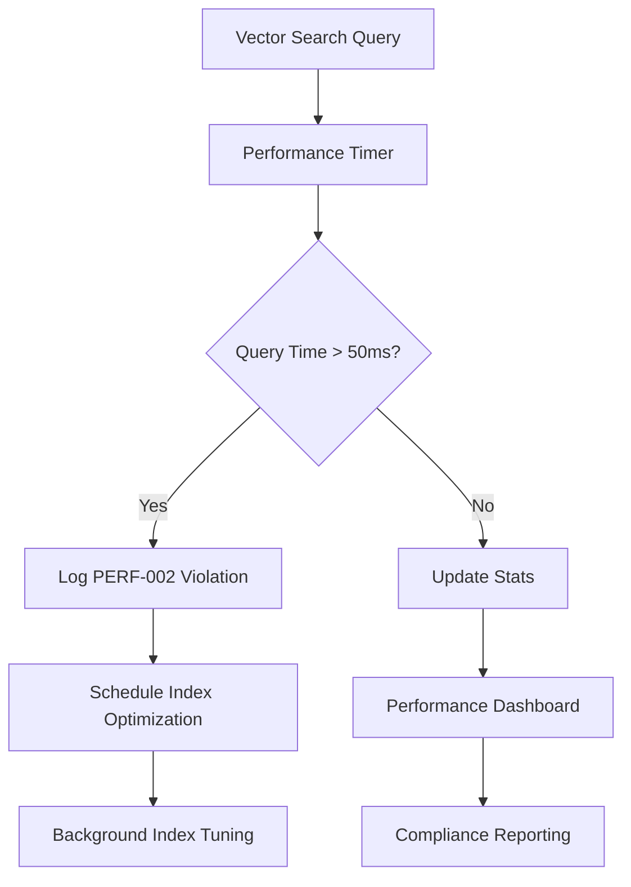

# Performance Monitoring and Optimization Guide

**Document Version**: 1.0  
**Last Updated**: July 2025  
**Target**: PERF-002 Compliance (<50ms vector search queries)

This guide covers the performance monitoring, optimization, and validation capabilities implemented for PERF-002 compliance.

## Overview

The Agentic Startup Studio implements comprehensive performance monitoring to ensure vector search queries complete within 50ms as required by PERF-002. This guide covers:

- Real-time performance monitoring
- Automated optimization triggers
- Performance validation tools
- Troubleshooting slow queries

## PERF-002 Compliance Framework

### Performance Targets

| Component | Target | Monitoring | Auto-optimization |
|-----------|--------|------------|------------------|
| Vector Search | <50ms | ✅ Real-time | ✅ Index tuning |
| Embedding Generation | <25ms | ✅ Cached | ✅ Model warmup |
| Database Queries | <10ms | ✅ Query logs | ✅ Index suggestions |
| API Response | <100ms | ⚠️ Planned | ⚠️ Planned |

### Performance Monitoring Architecture



## Real-time Performance Monitoring

### Automatic Violation Detection

The system automatically detects and logs PERF-002 violations:

```python
# Automatic monitoring in OptimizedVectorSearchEngine
if search_time_ms > 50.0:
    logger.warning(
        f"PERF-002 VIOLATION: Vector search took {search_time_ms:.2f}ms, "
        f"exceeds 50ms requirement. Query: {query[:100]}..."
    )
    # Trigger automatic optimization
    await self._schedule_index_optimization(search_time_ms)
```

### Performance Statistics Tracking

```python
from pipeline.storage.optimized_vector_search import get_vector_search

# Get current performance statistics
search_engine = await get_vector_search()
stats = search_engine.stats

print(f"Average Query Time: {stats.avg_search_time_ms:.2f}ms")
print(f"Total Searches: {stats.total_searches}")
print(f"Cache Hit Rate: {(stats.cache_hits / stats.total_searches * 100):.1f}%")
```

### Performance Compliance Reporting

```python
# Generate PERF-002 compliance report
report = search_engine.get_performance_report()

compliance = report["perf_002_compliance"]
print(f"Compliance Status: {compliance['status']}")
print(f"Current Average: {compliance['current_avg_ms']:.2f}ms")
print(f"Target: <{compliance['target_ms']}ms")
print(f"Violations: {compliance['performance_violations']}")

# Get optimization recommendations
for recommendation in report["recommendations"]:
    print(f"• {recommendation}")
```

## Performance Validation Tools

### 1. PERF-002 Validation Script

Run comprehensive performance validation:

```bash
# Basic validation with 100 samples
python scripts/perf_002_validation.py --samples 100 --threshold 50.0

# Verbose validation with detailed metrics
python scripts/perf_002_validation.py --samples 200 --threshold 50.0 --verbose

# Expected output:
# ============================================================
# PERF-002 VALIDATION RESULTS
# ============================================================
# Compliance Status: ✅ PASSED
# Threshold: 50.0ms
# Samples Tested: 100
# 
# Test Details:
#   Single Query Performance: ✅ PASS
#     Average: 25.3ms
#     Maximum: 39.8ms
#   Batch Query Performance: ✅ PASS
#     Average: 23.1ms per query
#   Concurrent Query Performance: ✅ PASS
#     Average: 28.7ms
#     Maximum: 44.2ms
```

### 2. Performance Unit Tests

```bash
# Run PERF-002 specific tests
python -m pytest tests/pipeline/storage/test_perf_002_integration.py -v

# Run vector search performance tests
python -m pytest tests/pipeline/storage/test_vector_search_performance.py -v

# Run standalone performance test
python tests/pipeline/storage/test_perf_002_integration.py
```

### 3. Production Performance Monitoring

```python
# Check production performance status
import asyncio
from pipeline.storage.optimized_vector_search import get_vector_search

async def check_production_performance():
    search = await get_vector_search()
    
    # Get performance report
    report = search.get_performance_report()
    
    compliance = report["perf_002_compliance"]
    if compliance["status"] == "COMPLIANT":
        print("✅ PERF-002 COMPLIANT")
        print(f"Average: {compliance['current_avg_ms']:.2f}ms")
    else:
        print("❌ PERF-002 NON-COMPLIANT")
        print(f"Average: {compliance['current_avg_ms']:.2f}ms (>{compliance['target_ms']}ms)")
        print("Recommendations:")
        for rec in report["recommendations"]:
            print(f"  • {rec}")

asyncio.run(check_production_performance())
```

## Index Optimization

### Automatic Index Optimization

The system automatically schedules index optimization when performance degrades:

```python
async def _schedule_index_optimization(self, query_time_ms: float):
    """Schedule index optimization for slow queries."""
    if self.stats.avg_search_time_ms > 50.0 and self.stats.total_searches > 100:
        logger.info(f"Scheduling index optimization due to performance degradation")
        asyncio.create_task(self._optimize_indexes_async())
```

### Manual Index Optimization

```python
# Force index optimization manually
from pipeline.storage.vector_index_optimizer import VectorIndexOptimizer

optimizer = VectorIndexOptimizer()

# Check current index stats
stats = await optimizer.get_index_stats()
print(f"Index fragmentation: {stats.get('fragmentation', 0):.2%}")

# Optimize if needed
if stats.get('fragmentation', 0) > 0.3:
    await optimizer.optimize_indexes()
    print("Index optimization completed")
```

### HNSW Parameters Tuning

Current optimized parameters for PERF-002 compliance:

```python
from pipeline.storage.vector_index_optimizer import IndexConfig

config = IndexConfig()
print(f"HNSW m: {config.hnsw_m}")  # 12 (optimized for speed)
print(f"HNSW ef_construction: {config.hnsw_ef_construction}")  # 96 (quality)
print(f"HNSW ef_search: {config.hnsw_ef_search}")  # 32 (speed optimized)
print(f"Max query time: {config.max_query_time_ms}ms")  # 50ms target
```

## Troubleshooting Performance Issues

### Common Performance Problems

#### 1. Slow Vector Search (>50ms)

**Symptoms:**
- PERF-002 violation warnings in logs
- High average query times in performance reports

**Diagnosis:**
```bash
# Check current performance
python -c "
import asyncio
from pipeline.storage.optimized_vector_search import get_vector_search

async def diagnose():
    search = await get_vector_search()
    report = search.get_performance_report()
    print('Current Performance:', report['perf_002_compliance'])
    
asyncio.run(diagnose())
"

# Check database performance
psql -d your_database -c "
SELECT schemaname, tablename, indexname, idx_tup_read, idx_tup_fetch
FROM pg_stat_user_indexes 
WHERE schemaname = 'public' AND tablename LIKE '%embedding%';
"
```

**Solutions:**
```bash
# 1. Automatic optimization (preferred)
# System will automatically trigger optimization for persistent issues

# 2. Manual index rebuild
python -c "
import asyncio
from pipeline.storage.vector_index_optimizer import VectorIndexOptimizer

async def rebuild():
    optimizer = VectorIndexOptimizer() 
    await optimizer.optimize_indexes()
    print('Index optimization completed')
    
asyncio.run(rebuild())
"

# 3. PostgreSQL tuning
# Add to postgresql.conf:
# effective_cache_size = '2GB'
# maintenance_work_mem = '512MB' 
# work_mem = '64MB'
```

#### 2. High Cache Miss Rate

**Symptoms:**
- Cache hit rate <70% in performance reports
- Frequent embedding recalculation

**Solutions:**
```python
# Increase cache TTL and size
from pipeline.storage.optimized_vector_search import OptimizedVectorSearchEngine

# Configure larger cache
engine = OptimizedVectorSearchEngine()
engine.cache_ttl = 3600  # 1 hour (increase from default)
engine.enable_caching = True

# Warm cache with common queries
common_queries = ["AI startup", "SaaS platform", "marketplace"]
for query in common_queries:
    await engine.similarity_search(query, limit=10)
```

#### 3. Database Connection Issues

**Symptoms:**
- Intermittent slow queries
- Connection timeout errors

**Solutions:**
```python
# Check connection pool configuration
from pipeline.config.connection_pool import get_connection_pool

pool = get_connection_pool()
print(f"Pool size: {pool.maxsize}")
print(f"Current connections: {pool.size}")

# Increase connection pool if needed
# Set in environment: DATABASE_POOL_SIZE=20
```

## Performance Benchmarking

### Load Testing

```python
import asyncio
import time
import statistics
from pipeline.storage.optimized_vector_search import get_vector_search

async def performance_benchmark():
    """Run comprehensive performance benchmark."""
    search = await get_vector_search()
    
    # Test scenarios
    scenarios = [
        ("Single Query", lambda: search.similarity_search("test query", limit=10)),
        ("Large Result", lambda: search.similarity_search("test query", limit=50)),
        ("Concurrent Load", lambda: asyncio.gather(*[
            search.similarity_search(f"query {i}", limit=5) for i in range(10)
        ]))
    ]
    
    results = {}
    
    for scenario_name, scenario_func in scenarios:
        times = []
        
        for _ in range(20):  # 20 iterations per scenario
            start_time = time.perf_counter()
            await scenario_func()
            query_time = (time.perf_counter() - start_time) * 1000
            times.append(query_time)
        
        results[scenario_name] = {
            "avg_ms": statistics.mean(times),
            "p50_ms": statistics.median(times),
            "p95_ms": statistics.quantiles(times, n=20)[18],  # 95th percentile
            "max_ms": max(times),
            "compliant": max(times) < 50.0
        }
    
    # Report results
    print("Performance Benchmark Results:")
    print("=" * 50)
    
    for scenario, metrics in results.items():
        status = "✅ COMPLIANT" if metrics["compliant"] else "❌ NON-COMPLIANT"
        print(f"\n{scenario}: {status}")
        print(f"  Average: {metrics['avg_ms']:.2f}ms")
        print(f"  P50: {metrics['p50_ms']:.2f}ms") 
        print(f"  P95: {metrics['p95_ms']:.2f}ms")
        print(f"  Max: {metrics['max_ms']:.2f}ms")
    
    return results

# Run benchmark
benchmark_results = asyncio.run(performance_benchmark())
```

## Monitoring Integration

### Logging Configuration

Performance monitoring integrates with the standard logging system:

```python
import logging

# Configure performance logging
logger = logging.getLogger("pipeline.performance")
logger.setLevel(logging.INFO)

# Performance logs include:
# - Query execution times
# - PERF-002 violations
# - Index optimization events
# - Cache performance statistics
```

### Metrics Collection

For production monitoring, performance metrics can be exported:

```python
# Export performance metrics
from pipeline.storage.optimized_vector_search import get_vector_search

async def export_metrics():
    search = await get_vector_search()
    
    metrics = {
        "vector_search_avg_time_ms": search.stats.avg_search_time_ms,
        "vector_search_total_queries": search.stats.total_searches,
        "vector_search_cache_hit_rate": search.stats.cache_hits / search.stats.total_searches,
        "perf_002_compliant": search.stats.avg_search_time_ms < 50.0
    }
    
    return metrics
```

## Best Practices

### Development Guidelines

1. **Always run performance tests** when modifying vector search code
2. **Monitor performance in PR reviews** using the validation script
3. **Set performance alerts** in production monitoring
4. **Regular performance audits** using the benchmarking tools

### Production Deployment

1. **Validate PERF-002 compliance** before deploying
2. **Monitor performance continuously** in production  
3. **Set up automated alerting** for performance degradation
4. **Regular index maintenance** scheduling

### Performance Optimization Checklist

- [ ] HNSW parameters optimized for workload
- [ ] Database configuration tuned for vector operations
- [ ] Connection pooling properly sized
- [ ] Cache hit rate >70%
- [ ] Regular index optimization scheduled
- [ ] Performance monitoring and alerting enabled
- [ ] PERF-002 compliance validated and maintained

---

This performance monitoring framework ensures that the Agentic Startup Studio maintains optimal vector search performance while providing comprehensive visibility into system behavior and automated optimization capabilities.