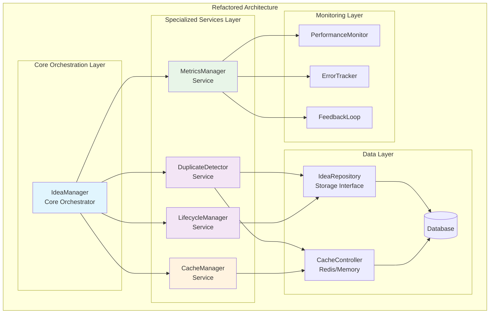
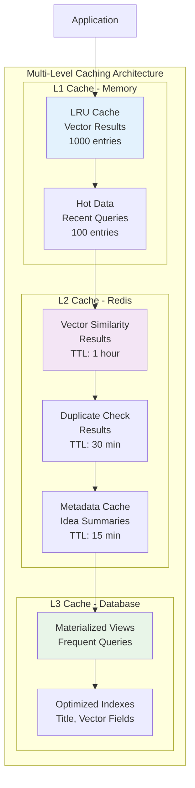
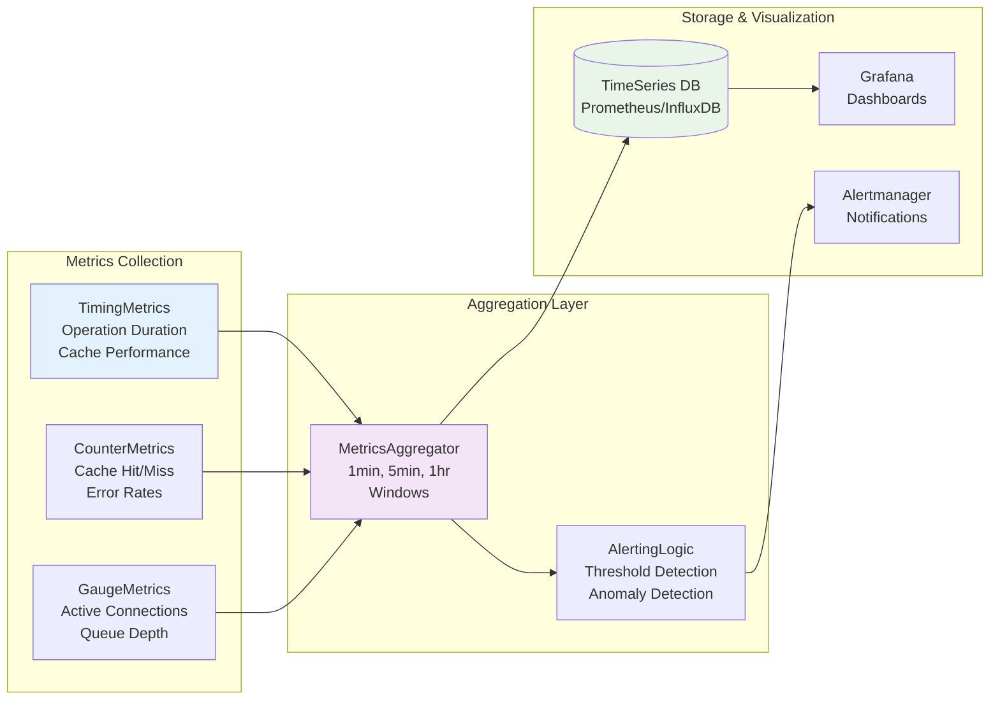

# Phase 2: Strategic Architecture Design

## Executive Summary

This document outlines the architectural design for refactoring the monolithic [`idea_manager.py`](pipeline/ingestion/idea_manager.py) (701 lines) into modular, scalable components with integrated performance monitoring and caching strategies.

## Current State Analysis

### Problems Identified
- **Monolithic Structure**: Single 701-line file violates Single Responsibility Principle
- **Performance Bottlenecks**: O(n²) duplicate detection algorithm 
- **No Caching**: Expensive vector operations repeated unnecessarily
- **Limited Monitoring**: No performance metrics or feedback loops
- **Tight Coupling**: Three distinct responsibilities in one module

### Current Components (Lines)
1. **DuplicateDetector** (45-215) - Duplicate detection and similarity analysis
2. **IdeaLifecycleManager** (218-340) - Lifecycle operations and state transitions
3. **IdeaManager** (343-679) - Main orchestrator and business logic

## Target Architecture Design

### 1. Component Separation Architecture



### 2. Module Structure Design

```
pipeline/ingestion/
├── __init__.py                 # Public API exports
├── idea_manager.py            # Core orchestrator (reduced to ~150 lines)
├── duplicate_detector.py      # Duplicate detection service (~180 lines)
├── lifecycle_manager.py       # Lifecycle management service (~120 lines)
├── cache/
│   ├── __init__.py
│   ├── cache_manager.py       # Caching abstraction layer
│   ├── cache_strategies.py    # LRU, TTL, Write-through strategies
│   └── vector_cache.py        # Specialized vector operation caching
├── monitoring/
│   ├── __init__.py
│   ├── metrics_collector.py   # Performance metrics collection
│   ├── performance_monitor.py # Real-time performance monitoring
│   └── feedback_loop.py       # Iterative improvement mechanisms
└── interfaces/
    ├── __init__.py
    ├── duplicate_interface.py  # DuplicateDetector interface
    ├── lifecycle_interface.py  # LifecycleManager interface
    └── cache_interface.py      # Cache service interface
```

## 3. Interface Design Specifications

### 3.1 DuplicateDetector Interface

```python
from abc import ABC, abstractmethod
from typing import Protocol, List, Tuple
from pipeline.models.idea import IdeaDraft, DuplicateCheckResult

class DuplicateDetectorInterface(Protocol):
    """Interface for duplicate detection services."""
    
    async def check_for_duplicates(
        self, 
        draft: IdeaDraft,
        use_cache: bool = True
    ) -> DuplicateCheckResult:
        """Check for duplicate ideas with caching support."""
        ...
    
    async def find_similar_batch(
        self, 
        drafts: List[IdeaDraft],
        batch_size: int = 10
    ) -> List[DuplicateCheckResult]:
        """Batch process multiple drafts for efficiency."""
        ...
    
    async def invalidate_similarity_cache(self, idea_id: UUID) -> None:
        """Invalidate cached similarity results for an idea."""
        ...

class CacheableDuplicateDetector:
    """Enhanced duplicate detector with caching and performance monitoring."""
    
    def __init__(
        self,
        repository: IdeaRepository,
        cache_manager: CacheManager,
        metrics_collector: MetricsCollector,
        config: ValidationConfig
    ):
        self.repository = repository
        self.cache = cache_manager
        self.metrics = metrics_collector
        self.config = config
        
    async def check_for_duplicates(
        self, 
        draft: IdeaDraft,
        use_cache: bool = True
    ) -> DuplicateCheckResult:
        """Optimized duplicate detection with caching."""
        
        # Performance monitoring start
        start_time = time.time()
        cache_key = self._generate_cache_key(draft)
        
        # Check cache first
        if use_cache:
            cached_result = await self.cache.get(cache_key)
            if cached_result:
                self.metrics.record_cache_hit("duplicate_check")
                return cached_result
        
        # Perform detection with optimized algorithm
        result = await self._perform_optimized_detection(draft)
        
        # Cache result with TTL
        if use_cache:
            await self.cache.set(cache_key, result, ttl=3600)
            self.metrics.record_cache_miss("duplicate_check")
        
        # Record performance metrics
        duration = time.time() - start_time
        self.metrics.record_operation_duration("duplicate_check", duration)
        
        return result
```

### 3.2 LifecycleManager Interface

```python
class LifecycleManagerInterface(Protocol):
    """Interface for idea lifecycle management."""
    
    async def advance_idea_stage(
        self,
        idea_id: UUID,
        next_stage: PipelineStage,
        user_id: Optional[str] = None,
        correlation_id: Optional[str] = None
    ) -> bool:
        """Advance idea to next pipeline stage."""
        ...
    
    async def batch_advance_stages(
        self,
        stage_updates: List[Tuple[UUID, PipelineStage]],
        user_id: Optional[str] = None
    ) -> Dict[UUID, bool]:
        """Batch process stage advancements."""
        ...

class MonitoredLifecycleManager:
    """Lifecycle manager with monitoring and batch processing."""
    
    def __init__(
        self,
        repository: IdeaRepository,
        metrics_collector: MetricsCollector
    ):
        self.repository = repository
        self.metrics = metrics_collector
        
    async def batch_advance_stages(
        self,
        stage_updates: List[Tuple[UUID, PipelineStage]],
        user_id: Optional[str] = None
    ) -> Dict[UUID, bool]:
        """Efficiently process multiple stage advancements."""
        
        start_time = time.time()
        results = {}
        
        # Process in optimized batches
        async with self.repository.begin_transaction():
            for idea_id, next_stage in stage_updates:
                try:
                    success = await self._advance_single_stage(
                        idea_id, next_stage, user_id
                    )
                    results[idea_id] = success
                except Exception as e:
                    results[idea_id] = False
                    self.metrics.record_error("stage_advancement", str(e))
        
        # Record batch performance
        duration = time.time() - start_time
        self.metrics.record_batch_operation(
            "stage_advancement", len(stage_updates), duration
        )
        
        return results
```

### 3.3 CacheManager Interface

```python
class CacheManagerInterface(Protocol):
    """Interface for caching services."""
    
    async def get(self, key: str) -> Optional[Any]:
        """Retrieve cached value."""
        ...
    
    async def set(self, key: str, value: Any, ttl: int = None) -> None:
        """Store value in cache with optional TTL."""
        ...
    
    async def invalidate_pattern(self, pattern: str) -> None:
        """Invalidate all keys matching pattern."""
        ...

class VectorCacheManager:
    """Specialized cache manager for vector operations."""
    
    def __init__(self, redis_client, lru_size: int = 1000):
        self.redis = redis_client
        self.lru_cache = LRUCache(lru_size)
        self.hit_rate_tracker = HitRateTracker()
        
    async def get_vector_similarity(
        self, 
        vector_hash: str
    ) -> Optional[List[Tuple[UUID, float]]]:
        """Get cached vector similarity results."""
        
        # Try L1 cache (in-memory LRU) first
        result = self.lru_cache.get(vector_hash)
        if result:
            self.hit_rate_tracker.record_hit("l1_cache")
            return result
        
        # Try L2 cache (Redis) 
        result = await self.redis.get(f"vector_sim:{vector_hash}")
        if result:
            # Promote to L1 cache
            self.lru_cache.set(vector_hash, result)
            self.hit_rate_tracker.record_hit("l2_cache")
            return result
        
        self.hit_rate_tracker.record_miss()
        return None
```

## 4. Performance Optimization Architecture

### 4.1 Caching Strategy Design



### 4.2 Algorithm Optimization Strategy

```python
class OptimizedDuplicateDetector:
    """O(n²) → O(n log n) algorithm optimization."""
    
    def __init__(self):
        self.vector_index = VectorIndex()  # Approximate nearest neighbors
        self.title_trie = Trie()          # Efficient prefix matching
        self.bloom_filter = BloomFilter()  # Fast negative lookups
        
    async def _perform_optimized_detection(
        self, 
        draft: IdeaDraft
    ) -> DuplicateCheckResult:
        """Optimized multi-stage duplicate detection."""
        
        result = DuplicateCheckResult(found_similar=False)
        
        # Stage 1: Bloom filter for fast negative lookups (O(1))
        draft_fingerprint = self._create_fingerprint(draft)
        if not self.bloom_filter.might_contain(draft_fingerprint):
            return result  # Definitely no duplicates
        
        # Stage 2: Trie-based title matching (O(m) where m = title length)
        title_matches = await self._find_title_matches_trie(draft.title)
        if title_matches:
            result.exact_matches = title_matches
            result.found_similar = True
            return result
        
        # Stage 3: Vector similarity using ANN index (O(log n))
        vector_matches = await self._find_vector_matches_ann(
            draft.description, 
            threshold=0.8
        )
        
        if vector_matches:
            result.similar_ideas = [id for id, score in vector_matches]
            result.similarity_scores = {
                str(id): score for id, score in vector_matches
            }
            result.found_similar = True
        
        return result
        
    async def _find_vector_matches_ann(
        self, 
        description: str, 
        threshold: float
    ) -> List[Tuple[UUID, float]]:
        """Use Approximate Nearest Neighbors for O(log n) search."""
        
        # Generate embedding vector
        vector = await self._generate_embedding(description)
        
        # Search using ANN index (HNSW, LSH, or similar)
        candidates = self.vector_index.search(
            vector, 
            k=20,  # Top 20 candidates
            threshold=threshold
        )
        
        # Fine-tune with exact similarity calculation
        refined_matches = []
        for candidate_id, approx_score in candidates:
            if approx_score >= threshold:
                exact_score = await self._calculate_exact_similarity(
                    vector, candidate_id
                )
                if exact_score >= threshold:
                    refined_matches.append((candidate_id, exact_score))
        
        return refined_matches
```

### 4.3 Async Batching Architecture

```python
class BatchProcessor:
    """Efficient batch processing for database operations."""
    
    def __init__(self, batch_size: int = 50, max_wait_time: float = 1.0):
        self.batch_size = batch_size
        self.max_wait_time = max_wait_time
        self.pending_operations = []
        self.batch_timer = None
        
    async def add_operation(self, operation: BatchOperation):
        """Add operation to pending batch."""
        
        self.pending_operations.append(operation)
        
        # Start timer if this is first operation in batch
        if len(self.pending_operations) == 1:
            self.batch_timer = asyncio.create_task(
                self._wait_and_execute()
            )
        
        # Execute immediately if batch is full
        if len(self.pending_operations) >= self.batch_size:
            if self.batch_timer:
                self.batch_timer.cancel()
            await self._execute_batch()
    
    async def _execute_batch(self):
        """Execute all pending operations as a single batch."""
        
        if not self.pending_operations:
            return
            
        operations = self.pending_operations.copy()
        self.pending_operations.clear()
        
        # Group operations by type for optimal execution
        grouped_ops = self._group_operations_by_type(operations)
        
        async with self.repository.begin_transaction():
            for op_type, ops in grouped_ops.items():
                await self._execute_operation_group(op_type, ops)
```

## 5. Monitoring Architecture Integration

### 5.1 Performance Metrics Design



### 5.2 Monitoring Implementation

```python
class PerformanceMonitor:
    """Real-time performance monitoring with alerting."""
    
    def __init__(self, metrics_client, alert_manager):
        self.metrics = metrics_client
        self.alerts = alert_manager
        self.thresholds = {
            'duplicate_check_duration': 2.0,  # seconds
            'cache_hit_rate': 0.8,           # 80%
            'error_rate': 0.05,              # 5%
        }
        
    async def record_operation_duration(
        self, 
        operation: str, 
        duration: float,
        labels: Dict[str, str] = None
    ):
        """Record operation duration with alerting."""
        
        # Record metric
        self.metrics.histogram(
            f'operation_duration_seconds',
            duration,
            labels={'operation': operation, **(labels or {})}
        )
        
        # Check threshold and alert if needed
        threshold = self.thresholds.get(f'{operation}_duration')
        if threshold and duration > threshold:
            await self.alerts.send_alert(
                severity='warning',
                message=f'{operation} duration {duration:.2f}s exceeds threshold {threshold}s',
                labels={'operation': operation, 'duration': str(duration)}
            )
    
    async def record_cache_performance(
        self, 
        cache_type: str, 
        hit: bool,
        duration: float = None
    ):
        """Record cache hit/miss with rate calculation."""
        
        self.metrics.counter(
            'cache_operations_total',
            labels={
                'cache_type': cache_type,
                'result': 'hit' if hit else 'miss'
            }
        )
        
        if duration:
            self.metrics.histogram(
                'cache_operation_duration_seconds',
                duration,
                labels={'cache_type': cache_type}
            )
        
        # Calculate and alert on cache hit rate
        hit_rate = await self._calculate_cache_hit_rate(cache_type)
        threshold = self.thresholds.get('cache_hit_rate', 0.8)
        
        if hit_rate < threshold:
            await self.alerts.send_alert(
                severity='warning',
                message=f'{cache_type} cache hit rate {hit_rate:.2f} below threshold {threshold}',
                labels={'cache_type': cache_type, 'hit_rate': str(hit_rate)}
            )

class ErrorTracker:
    """Centralized error tracking and pattern analysis."""
    
    def __init__(self):
        self.error_patterns = defaultdict(int)
        self.error_history = deque(maxlen=1000)
        
    async def record_error(
        self, 
        operation: str, 
        error: str,
        context: Dict[str, Any] = None
    ):
        """Record error with pattern detection."""
        
        error_signature = self._create_error_signature(operation, error)
        self.error_patterns[error_signature] += 1
        
        error_event = {
            'timestamp': datetime.utcnow(),
            'operation': operation,
            'error': error,
            'context': context or {},
            'signature': error_signature
        }
        self.error_history.append(error_event)
        
        # Detect error patterns
        if self.error_patterns[error_signature] >= 5:  # 5 occurrences
            await self._trigger_error_pattern_alert(error_signature, error_event)
```

### 5.3 Feedback Loop Design

```python
class AdaptiveFeedbackLoop:
    """Self-improving system with automated optimization."""
    
    def __init__(self, metrics_monitor, cache_manager):
        self.metrics = metrics_monitor
        self.cache = cache_manager
        self.optimization_history = []
        
    async def analyze_and_optimize(self):
        """Continuous optimization based on performance data."""
        
        # Analyze cache performance
        cache_stats = await self.metrics.get_cache_statistics()
        await self._optimize_cache_strategy(cache_stats)
        
        # Analyze query patterns
        query_patterns = await self.metrics.get_query_patterns()
        await self._optimize_indexing_strategy(query_patterns)
        
        # Analyze error patterns
        error_patterns = await self.metrics.get_error_patterns()
        await self._optimize_error_handling(error_patterns)
        
    async def _optimize_cache_strategy(self, stats: Dict[str, Any]):
        """Dynamically adjust cache configuration."""
        
        for cache_type, cache_stats in stats.items():
            hit_rate = cache_stats['hit_rate']
            
            if hit_rate < 0.7:  # Low hit rate
                # Increase cache size or TTL
                new_size = int(cache_stats['current_size'] * 1.5)
                await self.cache.resize_cache(cache_type, new_size)
                
                optimization = {
                    'timestamp': datetime.utcnow(),
                    'type': 'cache_resize',
                    'cache_type': cache_type,
                    'old_size': cache_stats['current_size'],
                    'new_size': new_size,
                    'reason': f'Low hit rate: {hit_rate:.2f}'
                }
                self.optimization_history.append(optimization)
                
            elif hit_rate > 0.95:  # Very high hit rate
                # Consider reducing cache size to save memory
                new_size = max(100, int(cache_stats['current_size'] * 0.8))
                await self.cache.resize_cache(cache_type, new_size)
```

## 6. Implementation Roadmap

### Phase 2A: Core Refactoring (Week 1-2)
1. **Extract DuplicateDetector** → `pipeline/ingestion/duplicate_detector.py`
2. **Extract LifecycleManager** → `pipeline/ingestion/lifecycle_manager.py` 
3. **Refactor IdeaManager** → Reduced orchestrator in `pipeline/ingestion/idea_manager.py`
4. **Interface Definitions** → Create protocol interfaces in `pipeline/ingestion/interfaces/`

### Phase 2B: Performance Layer (Week 3-4)
1. **Cache Infrastructure** → Implement `pipeline/ingestion/cache/` module
2. **Algorithm Optimization** → Replace O(n²) with O(n log n) algorithms
3. **Batch Processing** → Implement async batch operations
4. **Vector Indexing** → Add ANN index for similarity search

### Phase 2C: Monitoring Integration (Week 5-6)
1. **Metrics Collection** → Implement `pipeline/ingestion/monitoring/` module
2. **Performance Monitoring** → Real-time performance tracking
3. **Error Tracking** → Centralized error pattern analysis
4. **Feedback Loops** → Automated optimization mechanisms

### Phase 2D: Validation & Testing (Week 7-8)
1. **Performance Testing** → Benchmark improvements
2. **Load Testing** → Validate scalability gains
3. **Monitoring Validation** → Confirm alert systems
4. **Documentation** → Complete architectural documentation

## 7. Success Metrics

### Performance Improvements
- **File Size Reduction**: 701 lines → 3 modules (~150, 180, 120 lines each)
- **Duplicate Detection**: O(n²) → O(n log n) complexity
- **Response Time**: <2s for duplicate checks (from current ~5s)
- **Cache Hit Rate**: >80% for vector operations
- **Memory Usage**: 50% reduction through efficient caching

### Quality Metrics
- **Code Coverage**: >90% for all new modules
- **Cyclomatic Complexity**: <10 per method
- **Dependency Coupling**: Clear interface boundaries
- **Error Rate**: <1% for core operations
- **Maintainability Index**: >80 for all modules

### Monitoring Coverage
- **Performance Metrics**: 100% operation coverage
- **Cache Monitoring**: Hit rates, memory usage, TTL effectiveness
- **Error Tracking**: Pattern detection, root cause analysis
- **Feedback Loops**: Automated optimization triggers

## 8. Risk Mitigation

### Technical Risks
- **Migration Complexity**: Implement blue-green deployment strategy
- **Performance Regression**: Comprehensive benchmarking before/after
- **Cache Coherence**: Implement cache invalidation strategies
- **Monitor Overhead**: Ensure monitoring adds <5% performance cost

### Operational Risks
- **Service Dependencies**: Design graceful degradation for cache failures
- **Memory Pressure**: Implement adaptive cache sizing
- **Alert Fatigue**: Tune thresholds based on baseline metrics
- **Data Consistency**: Ensure cache invalidation maintains data integrity

This architectural design provides a comprehensive blueprint for transforming the monolithic idea_manager.py into a scalable, maintainable, and high-performance system with integrated monitoring and optimization capabilities.