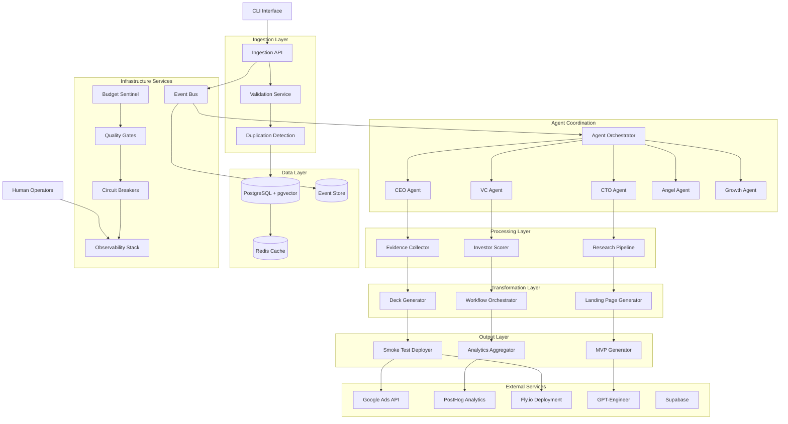
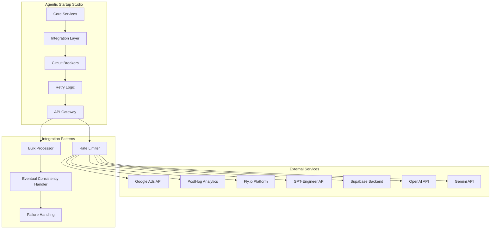
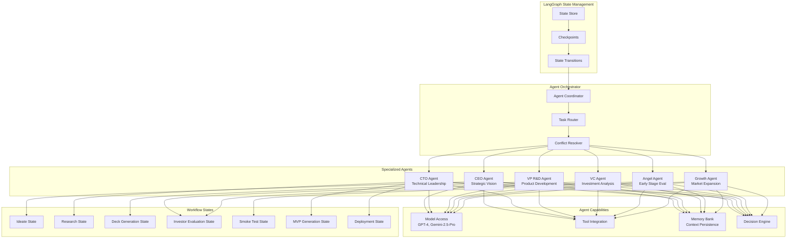
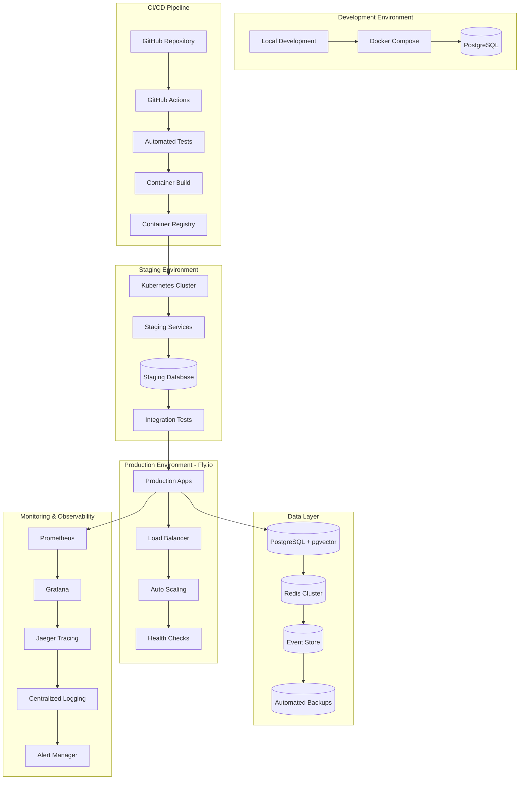
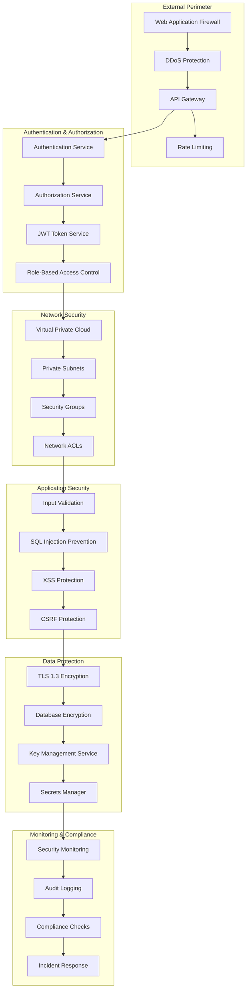
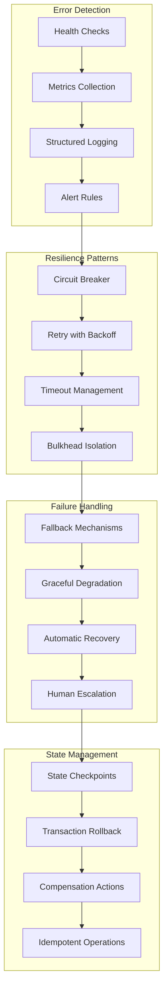

# Agentic Startup Studio - System Architecture

## Executive Summary

This document defines the complete system architecture for the Agentic Startup Studio data pipeline, implementing an event-driven microservices architecture with multi-agent coordination through LangGraph state management. The system processes startup ideas through a validated pipeline from ingestion to market deployment.

## Architecture Overview

### Core Principles
- **Event-Driven**: Asynchronous processing with domain events
- **Microservices**: Loosely coupled services with clear boundaries
- **Agent-Centric**: AI agents orchestrate workflow stages
- **Cost-Controlled**: Budget sentinels prevent overruns
- **Resilient**: Circuit breakers, retries, and graceful degradation

### Quality Attributes
- **Throughput**: ≥4 ideas per month, <4 hours pipeline completion
- **Reliability**: 99% uptime with automatic recovery
- **Scalability**: 10x throughput increase without architecture changes
- **Security**: Defense-in-depth with audit trails
- **Cost Efficiency**: $12 GPT + $50 ads per idea cycle

## 1. System Architecture Diagram



## 2. Service Boundaries & Responsibilities

### 2.1 Ingestion Services

#### **Ingestion API Service**
- **Responsibility**: Startup idea intake and initial processing
- **Interfaces**: REST API, CLI commands
- **Data Ownership**: Idea drafts, validation results
- **SLA**: 99.9% availability, <200ms response time

```yaml
Ingestion API:
  endpoints:
    - POST /api/v1/ideas
    - GET /api/v1/ideas
    - PUT /api/v1/ideas/{id}
    - DELETE /api/v1/ideas/{id}
  dependencies:
    - Validation Service
    - Duplication Detection
    - Event Bus
  scaling: horizontal
  resource_requirements:
    cpu: 1-4 cores
    memory: 2-8GB
    storage: ephemeral
```

#### **Validation Service**
- **Responsibility**: Input sanitization and schema validation
- **Interfaces**: gRPC internal API
- **Data Ownership**: Validation rules, sanitization logs
- **SLA**: 99.9% availability, <100ms processing time

#### **Duplication Detection Service**
- **Responsibility**: Similarity analysis using pgvector
- **Interfaces**: gRPC internal API
- **Data Ownership**: Embeddings, similarity thresholds
- **SLA**: 99.5% availability, <500ms similarity search

### 2.2 Processing Services

#### **Evidence Collector Service**
- **Responsibility**: RAG-based research and citation gathering
- **Interfaces**: gRPC internal API, external RAG endpoints
- **Data Ownership**: Evidence items, citations, credibility scores
- **SLA**: 99% availability, <5min collection time

#### **Research Pipeline Service**
- **Responsibility**: Parallel research across multiple domains
- **Interfaces**: gRPC internal API, external research APIs
- **Data Ownership**: Research reports, domain analysis
- **SLA**: 99% availability, <10min research time

#### **Investor Scorer Service**
- **Responsibility**: Weighted scoring using configurable rubrics
- **Interfaces**: gRPC internal API
- **Data Ownership**: Scoring rubrics, evaluation results
- **SLA**: 99.9% availability, <1min scoring time

### 2.3 Transformation Services

#### **Deck Generator Service**
- **Responsibility**: Marp-compatible presentation generation
- **Interfaces**: gRPC internal API
- **Data Ownership**: Deck templates, generated presentations
- **SLA**: 99% availability, <2min generation time

#### **Landing Page Generator Service**
- **Responsibility**: Next.js static page generation
- **Interfaces**: gRPC internal API
- **Data Ownership**: Page templates, generated sites
- **SLA**: 99% availability, <3min generation time

#### **Workflow Orchestrator Service**
- **Responsibility**: LangGraph state machine management
- **Interfaces**: gRPC internal API, WebSocket for real-time updates
- **Data Ownership**: State transitions, checkpoint data
- **SLA**: 99.9% availability, atomic state transitions

### 2.4 Output Services

#### **Smoke Test Deployer Service**
- **Responsibility**: Campaign deployment and monitoring
- **Interfaces**: gRPC internal API, Google Ads API
- **Data Ownership**: Campaign configurations, metrics
- **SLA**: 99% availability, <5min deployment time

#### **MVP Generator Service**
- **Responsibility**: Code scaffolding and deployment
- **Interfaces**: gRPC internal API, GPT-Engineer API
- **Data Ownership**: MVP artifacts, deployment status
- **SLA**: 95% availability, <30min generation time

#### **Analytics Aggregator Service**
- **Responsibility**: Metrics collection and reporting
- **Interfaces**: gRPC internal API, PostHog API
- **Data Ownership**: Aggregated metrics, reports
- **SLA**: 99% availability, <5min delay for metrics

## 3. Data Flow Architecture

```mermaid
flowchart LR
    subgraph "Phase 1: Data Ingestion"
        A1[CLI Input] --> A2[Validation]
        A2 --> A3[Sanitization]
        A3 --> A4[Duplication Check]
        A4 --> A5[pgvector Similarity]
        A5 --> A6[Store Idea]
        A6 --> A7[Publish IdeaCreated Event]
    end
    
    subgraph "Phase 2: Data Processing"
        B1[Evidence Collection] --> B2[RAG Search]
        B2 --> B3[Citation Verification]
        B3 --> B4[Research Pipeline]
        B4 --> B5[Parallel Domain Analysis]
        B5 --> B6[Investor Scoring]
        B6 --> B7[Weighted Evaluation]
        B7 --> B8[Publish ProcessingComplete Event]
    end
    
    subgraph "Phase 3: Data Transformation"
        C1[Deck Generation] --> C2[Marp Template]
        C2 --> C3[Content Population]
        C3 --> C4[Landing Page Gen]
        C4 --> C5[Next.js Build]
        C5 --> C6[State Machine Update]
        C6 --> C7[Publish TransformationComplete Event]
    end
    
    subgraph "Phase 4: Data Output"
        D1[Smoke Test Deploy] --> D2[Google Ads Campaign]
        D2 --> D3[Metrics Collection]
        D3 --> D4[MVP Generation]
        D4 --> D5[GPT-Engineer Build]
        D5 --> D6[Fly.io Deployment]
        D6 --> D7[Analytics Aggregation]
        D7 --> D8[PostHog Integration]
        D8 --> D9[Publish OutputComplete Event]
    end
    
    A7 --> B1
    B8 --> C1
    C7 --> D1
    
    subgraph "Data Persistence"
        DB[(PostgreSQL)]
        VDB[(pgvector)]
        Cache[(Redis)]
        Events[(Event Store)]
    end
    
    A6 --> DB
    A5 --> VDB
    B3 --> DB
    B7 --> DB
    C6 --> DB
    D3 --> DB
    D7 --> DB
    
    A7 --> Events
    B8 --> Events
    C7 --> Events
    D9 --> Events
    
    B2 --> Cache
    C3 --> Cache
    D3 --> Cache
```



### 3.1 Data Consistency Patterns

#### **Strong Consistency**
- Budget limit enforcement (immediate)
- Quality gate validation (synchronous)
- State machine transitions (atomic)

#### **Eventually Consistent**
- Analytics metrics (≤5min delay acceptable)
- Health check status (15min update cycle)
- Budget spending records (during high throughput)

#### **Consistency Boundaries**
- **Idea Aggregate**: Evidence score recalculation on evidence changes
- **Campaign Aggregate**: Metrics recalculation on analytics updates
- **MVP Aggregate**: Health status updates on deployment changes

## 4. External Integration Architecture



### 4.1 Integration Contracts

#### **Google Ads Integration**
```yaml
google_ads_integration:
  api_version: v14
  authentication: OAuth2
  rate_limits:
    requests_per_minute: 10000
    daily_quota: 1000000
  circuit_breaker:
    failure_threshold: 5
    timeout: 30s
    recovery_timeout: 60s
  retry_policy:
    max_attempts: 3
    backoff: exponential
    base_delay: 1s
  endpoints:
    create_campaign: POST /v14/customers/{customer_id}/campaigns
    update_campaign: PATCH /v14/customers/{customer_id}/campaigns/{campaign_id}
    get_metrics: GET /v14/customers/{customer_id}/reports
```

#### **PostHog Analytics Integration**
```yaml
posthog_integration:
  api_version: v1
  authentication: api_key
  rate_limits:
    events_per_second: 1000
    batch_size: 100
  circuit_breaker:
    failure_threshold: 3
    timeout: 10s
    recovery_timeout: 30s
  retry_policy:
    max_attempts: 3
    backoff: exponential
    base_delay: 500ms
  endpoints:
    track_event: POST /api/v1/track
    get_insights: GET /api/v1/insights
    batch_events: POST /api/v1/batch
```

#### **Fly.io Deployment Integration**
```yaml
flyio_integration:
  api_version: v1
  authentication: bearer_token
  rate_limits:
    deployments_per_hour: 60
    api_calls_per_minute: 300
  circuit_breaker:
    failure_threshold: 5
    timeout: 60s
    recovery_timeout: 300s
  retry_policy:
    max_attempts: 3
    backoff: exponential
    base_delay: 2s
  endpoints:
    deploy_app: POST /v1/apps/{app_name}/deploy
    get_status: GET /v1/apps/{app_name}/status
    scale_app: POST /v1/apps/{app_name}/scale
```

## 5. Agent Architecture



### 5.1 Agent Specifications

#### **CEO Agent**
```yaml
ceo_agent:
  role: Strategic Vision & Leadership
  responsibilities:
    - Idea evaluation and prioritization
    - Strategic direction setting
    - Stakeholder alignment
    - Risk assessment
  model: GPT-4
  temperature: 0.7
  max_tokens: 2048
  tools:
    - market_research
    - competitive_analysis
    - trend_analysis
  workflow_stages:
    - ideate
    - strategic_review
  decision_authority: high
  escalation_threshold: budget_exceeded
```

#### **CTO Agent**
```yaml
cto_agent:
  role: Technical Leadership & Architecture
  responsibilities:
    - Technical feasibility assessment
    - Architecture design
    - Technology stack selection
    - Code quality oversight
  model: GPT-4
  temperature: 0.3
  max_tokens: 4096
  tools:
    - code_analysis
    - architecture_review
    - security_scan
    - performance_testing
  workflow_stages:
    - research
    - mvp_generation
    - deployment
  decision_authority: high
  escalation_threshold: technical_failure
```

#### **VC Agent**
```yaml
vc_agent:
  role: Investment Analysis & Due Diligence
  responsibilities:
    - Market size analysis
    - Competitive landscape evaluation
    - Business model assessment
    - Financial projections review
  model: Gemini-2.5-Pro
  temperature: 0.2
  max_tokens: 3072
  tools:
    - financial_modeling
    - market_analysis
    - competitive_intelligence
    - risk_assessment
  workflow_stages:
    - investor_evaluation
  decision_authority: medium
  escalation_threshold: funding_decision
```

### 5.2 Multi-Agent Coordination

#### **State Synchronization**
- **Shared State**: LangGraph state store with ACID properties
- **Conflict Resolution**: Priority-based with CEO override authority
- **Checkpoint Recovery**: Automatic rollback on agent failures
- **Memory Consistency**: Eventual consistency with 30s convergence

#### **Communication Patterns**
- **Event-Driven**: Agents communicate through domain events
- **Request-Response**: Synchronous coordination for critical decisions
- **Pub-Sub**: Asynchronous updates for non-critical information
- **Consensus**: Multi-agent voting for investment decisions

## 6. Deployment Architecture



### 6.1 Container Orchestration

#### **Service Definitions**
```yaml
services:
  ingestion-api:
    image: startup-studio/ingestion-api:latest
    replicas: 3
    resources:
      requests:
        cpu: 500m
        memory: 1Gi
      limits:
        cpu: 1000m
        memory: 2Gi
    health_check:
      path: /health
      interval: 30s
      timeout: 10s
      retries: 3
    scaling:
      min_replicas: 2
      max_replicas: 10
      target_cpu: 70%
      
  evidence-collector:
    image: startup-studio/evidence-collector:latest
    replicas: 2
    resources:
      requests:
        cpu: 1000m
        memory: 2Gi
      limits:
        cpu: 2000m
        memory: 4Gi
    health_check:
      path: /health
      interval: 60s
      timeout: 30s
      retries: 2
    scaling:
      min_replicas: 1
      max_replicas: 5
      target_cpu: 80%
```

### 6.2 Infrastructure as Code

#### **Terraform Configuration**
```hcl
# Fly.io Application Configuration
resource "fly_app" "startup_studio" {
  name = "agentic-startup-studio"
  org  = "startup-studio-org"
}

resource "fly_machine" "ingestion_api" {
  count  = 3
  app    = fly_app.startup_studio.name
  name   = "ingestion-api-${count.index}"
  region = "ord"
  
  image = "startup-studio/ingestion-api:latest"
  
  services {
    internal_port = 8080
    protocol      = "tcp"
    
    http_checks {
      path     = "/health"
      interval = "30s"
      timeout  = "10s"
    }
  }
  
  env = {
    NODE_ENV = "production"
    LOG_LEVEL = "info"
  }
}

# PostgreSQL Database
resource "fly_postgres" "primary" {
  name             = "startup-studio-db"
  org              = "startup-studio-org"
  region           = "ord"
  postgres_version = "15"
  
  vm_size = "shared-cpu-2x"
  volume_size = "50gb"
  
  extensions = ["vector"]
}
```

## 7. Security Architecture



### 7.1 Security Controls

#### **Authentication & Authorization**
```yaml
security_controls:
  authentication:
    method: JWT with refresh tokens
    token_expiry: 15m
    refresh_expiry: 7d
    mfa_enabled: true
    password_policy:
      min_length: 12
      complexity: high
      rotation: 90d
      
  authorization:
    model: RBAC
    roles:
      - admin: full_access
      - operator: read_write_ideas
      - viewer: read_only
    permissions:
      - create_idea: [admin, operator]
      - read_idea: [admin, operator, viewer]
      - update_idea: [admin, operator]
      - delete_idea: [admin]
      - access_metrics: [admin, operator]
```

#### **Data Protection**
```yaml
data_protection:
  encryption_in_transit:
    protocol: TLS 1.3
    cipher_suites:
      - TLS_AES_256_GCM_SHA384
      - TLS_CHACHA20_POLY1305_SHA256
    certificate_management: automated
    
  encryption_at_rest:
    database: AES-256-GCM
    files: AES-256-GCM
    key_rotation: 90d
    
  secrets_management:
    provider: HashiCorp Vault
    rotation: automated
    auditing: enabled
    
  data_classification:
    public: idea_titles, categories
    internal: descriptions, research
    confidential: financial_data, personal_info
    restricted: api_keys, credentials
```

### 7.2 Compliance Framework

#### **GDPR Compliance**
- **Data Minimization**: Collect only necessary data
- **Purpose Limitation**: Use data only for stated purposes
- **Consent Management**: Explicit consent for data processing
- **Right to Erasure**: Data deletion capabilities
- **Data Portability**: Export functionality
- **Breach Notification**: 72-hour notification requirement

#### **Security Audit Trail**
- **All API calls logged** with user attribution
- **Database changes tracked** with before/after states
- **Authentication events recorded** with timestamps
- **Access attempts monitored** with anomaly detection
- **Configuration changes audited** with approval workflows

## 8. Error Handling & Resilience



### 8.1 Circuit Breaker Patterns

#### **Service-Level Circuit Breakers**
```yaml
circuit_breakers:
  database_connection:
    failure_threshold: 5
    timeout: 30s
    recovery_timeout: 60s
    metrics:
      - connection_failures
      - response_time_p99
      - error_rate
      
  external_api_calls:
    failure_threshold: 3
    timeout: 10s
    recovery_timeout: 30s
    metrics:
      - http_5xx_errors
      - timeout_errors
      - rate_limit_errors
      
  ai_model_inference:
    failure_threshold: 10
    timeout: 120s
    recovery_timeout: 300s
    metrics:
      - model_errors
      - quota_exceeded
      - response_time_p95
```

### 8.2 Retry Strategies

#### **Exponential Backoff Configuration**
```yaml
retry_strategies:
  transient_errors:
    max_attempts: 3
    base_delay: 1s
    max_delay: 30s
    multiplier: 2
    jitter: 0.1
    
  external_api_calls:
    max_attempts: 5
    base_delay: 500ms
    max_delay: 60s
    multiplier: 1.5
    jitter: 0.2
    
  database_operations:
    max_attempts: 3
    base_delay: 100ms
    max_delay: 5s
    multiplier: 2
    jitter: 0.1
```

### 8.3 Graceful Degradation

#### **Fallback Mechanisms**
```yaml
fallback_mechanisms:
  evidence_collection:
    primary: external_rag_service
    fallback: cached_research_data
    degraded_mode: manual_research_prompts
    
  investor_scoring:
    primary: ai_model_evaluation
    fallback: rule_based_scoring
    degraded_mode: manual_review_queue
    
  landing_page_generation:
    primary: dynamic_template_generation
    fallback: static_template_library
    degraded_mode: basic_html_template
```

## Conclusion

This architecture provides a robust, scalable, and resilient foundation for the Agentic Startup Studio data pipeline. Key benefits include:

- **Modularity**: Clear service boundaries enable independent scaling and deployment
- **Resilience**: Circuit breakers, retries, and fallback mechanisms ensure high availability
- **Observability**: Comprehensive monitoring and logging provide operational visibility
- **Security**: Defense-in-depth approach protects against multiple threat vectors
- **Cost Control**: Budget sentinels and resource optimization prevent cost overruns
- **Extensibility**: Event-driven architecture supports future feature additions

The architecture balances complexity with maintainability, ensuring the system can evolve with changing requirements while maintaining operational excellence.