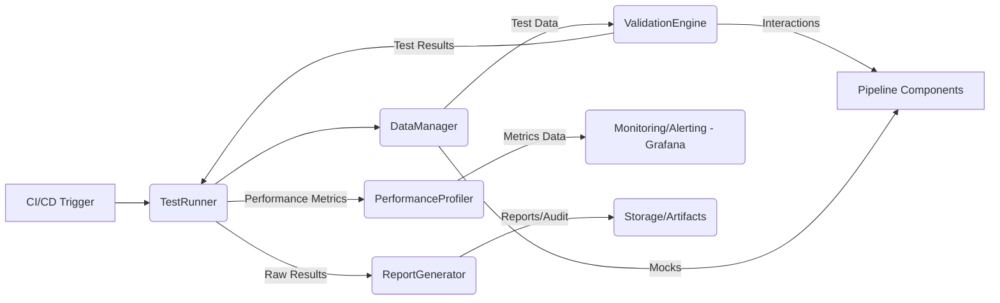

# Testing Framework Architecture for End-to-End Pipeline Validation

## 1. Overview

This document outlines the architecture for a comprehensive testing framework designed to validate the end-to-end data pipeline. The framework emphasizes modularity, extensibility, and maintainability, supporting various validation areas including functional, integration, performance, and security testing.

## 2. Architectural Goals

*   **Modularity**: Decoupled components for easy maintenance and extension.
*   **Extensibility**: Ability to add new validation areas and test types without significant refactoring.
*   **Maintainability**: Clear structure, well-defined interfaces, and comprehensive documentation.
*   **Scalability**: Support for parallel test execution and large datasets.
*   **Observability**: Real-time monitoring and detailed reporting of test results.
*   **Security**: Secure handling of test data and isolated test environments.

## 3. Core Components

### 3.1. TestRunner

*   **Responsibility**: Orchestrates the execution of test suites and individual tests. Manages test configurations, parallel execution, and dependency resolution between test stages.
*   **Inputs**: Test suite configuration, test data paths, environment variables.
*   **Outputs**: Execution commands for ValidationEngine, status updates.

### 3.2. ValidationEngine

*   **Responsibility**: Executes specific validation types (e.g., data integrity, business logic, API responses). It acts as an abstraction layer over underlying testing tools (e.g., Pytest).
*   **Inputs**: Validation area, test case parameters, data samples.
*   **Outputs**: Raw test results, success/failure status, metrics.

### 3.3. DataManager

*   **Responsibility**: Manages test data lifecycle, including generation, loading, sanitization, and cleanup. Integrates with mock services for external dependencies.
*   **Inputs**: Test data requirements, mock service configurations.
*   **Outputs**: Prepared test data, mock service endpoints.

### 3.4. ReportGenerator

*   **Responsibility**: Processes raw test results, aggregates metrics, and generates comprehensive reports in various formats (e.g., HTML, JSON, Markdown).
*   **Inputs**: Raw test results, performance metrics, audit trails.
*   **Outputs**: Formatted test reports, summary dashboards.

### 3.5. PerformanceProfiler

*   **Responsibility**: Collects performance metrics during test execution, benchmarks system behavior under load, and identifies bottlenecks.
*   **Inputs**: Performance test configurations, system metrics.
*   **Outputs**: Performance data, benchmark results, alerts for deviations.

## 4. Validation Pipeline Architecture

The validation pipeline will support both sequential and parallel execution flows, with robust dependency management, rollback, and cleanup mechanisms.

### 4.1. Execution Flow

```mermaid
graph TD
    A[Start Test Run] --> B{Initialize Environment};
    B --> C{Load Test Configuration};
    C --> D{Prepare Test Data (DataManager)};
    D --> E{Execute Pre-Validation Hooks};
    E --> F{Run Test Suites (TestRunner)};
    F --> G{Collect Results (ValidationEngine)};
    G --> H{Generate Reports (ReportGenerator)};
    H --> I{Execute Post-Validation Hooks};
    I --> J{Cleanup Environment};
    J --> K[End Test Run];

    subgraph Parallel Execution
        F --> F1[Component Validation];
        F --> F2[Integration Testing];
        F --> F3[Performance Testing];
        F --> F4[Security Testing];
    end
```

### 4.2. Dependency Management

Test stages can declare dependencies on previous stages. The `TestRunner` ensures that dependent stages only execute upon successful completion of their prerequisites.

### 4.3. Rollback and Cleanup

Each test run operates within an isolated environment (Docker containers). Post-execution, the `TestRunner` triggers cleanup mechanisms to remove temporary data, mock services, and container instances, ensuring a clean state for subsequent runs. Rollback procedures are defined for critical stages to revert system state in case of failures.

## 5. Integration Points

### 5.1. Existing Pipeline Components (`pipeline/`)

*   **Integration**: The `ValidationEngine` will directly interact with the pipeline's modules (e.g., `pipeline/ingestion/`, `pipeline/services/`, `pipeline/storage/`) by importing and calling their functions or by simulating external API calls.
*   **Rationale**: Enables unit, integration, and end-to-end testing of the actual pipeline code.

### 5.2. Test Infrastructure (`tests/`)

*   **Integration**: The existing `tests/` directory will house the test cases, organized by validation area. The `TestRunner` will discover and execute these tests using Pytest.
*   **Rationale**: Leverages existing test suite structure and Pytest capabilities.

### 5.3. Monitoring and Alerting Systems (e.g., Grafana)

*   **Integration**: The `ReportGenerator` and `PerformanceProfiler` will push metrics and logs to a centralized monitoring system (e.g., Prometheus/Grafana).
*   **Rationale**: Provides real-time visibility into test execution, performance trends, and immediate alerts on failures or performance regressions.

### 5.4. Performance Benchmarking Tools

*   **Integration**: The `PerformanceProfiler` will integrate with tools like Locust or JMeter (if applicable) for load generation and detailed performance analysis.
*   **Rationale**: Enables comprehensive performance and scalability testing.

### 5.5. CI/CD Pipeline

*   **Integration**: The entire testing framework will be integrated into the CI/CD pipeline, triggering automated test runs on code commits, pull requests, and scheduled intervals.
*   **Rationale**: Ensures continuous validation and early detection of issues.

## 6. Technology Stack Integration

*   **Pytest Enhancement**: Pytest will be the primary test framework. Custom plugins will be developed for parallel execution, test data parametrization, and reporting integration.
*   **Docker Containerization**: Each test run will be executed within isolated Docker containers to ensure environment consistency and prevent side effects. Docker Compose will manage multi-service test environments.
*   **Grafana Integration**: Grafana dashboards will visualize real-time test results, performance metrics, and historical trends, fed by Prometheus.
*   **CI/CD Pipeline**: GitHub Actions or Jenkins will orchestrate the test pipeline, including environment setup, test execution, and report publishing.

## 7. Security & Compliance

*   **Secure Test Data Handling**: Sensitive test data will be anonymized or synthetic. Access to production-like data will be strictly controlled and encrypted.
*   **Environment Isolation**: Docker containers ensure that test environments are isolated from production and other development environments.
*   **Audit Trail Generation**: Every test run will generate a detailed audit trail, logging execution parameters, results, and any environment changes.
*   **Compliance Validation Workflows**: Specific test suites will be designed to validate compliance requirements (e.g., data privacy, regulatory standards), generating reports for audit purposes.

## 8. Component Design Details

### 8.1. TestRunner (Python Module)

*   **Class**: `TestRunner`
*   **Methods**:
    *   `run_suite(suite_config)`: Loads configuration, initializes environment, calls `ValidationEngine`.
    *   `run_test(test_id, config)`: Executes a single test case.
    *   `manage_dependencies(stage_dependencies)`: Resolves and enforces test stage dependencies.
    *   `setup_environment(env_config)`: Creates isolated Docker containers.
    *   `teardown_environment()`: Cleans up Docker containers and temporary data.
*   **Dependencies**: `ValidationEngine`, `DataManager`, Docker API.

### 8.2. ValidationEngine (Python Module)

*   **Class**: `ValidationEngine`
*   **Methods**:
    *   `execute_validation(validation_type, test_params)`: Dispatches to specific validation handlers.
    *   `validate_data_integrity(data_set)`: Checks data consistency and schema.
    *   `validate_business_logic(input_data, expected_output)`: Verifies pipeline logic.
    *   `validate_api_response(endpoint, payload, expected_response)`: Tests service interfaces.
*   **Dependencies**: Pytest, pipeline components.

### 8.3. DataManager (Python Module)

*   **Class**: `DataManager`
*   **Methods**:
    *   `load_test_data(data_path)`: Loads data from files or databases.
    *   `generate_synthetic_data(schema, count)`: Creates synthetic data.
    *   `integrate_mock_service(service_config)`: Sets up and manages mock servers (e.g., `httpx-mock`, `responses`).
    *   `cleanup_test_data()`: Removes temporary test data.
*   **Dependencies**: Faker (for synthetic data), `httpx-mock`/`responses`.

### 8.4. ReportGenerator (Python Module)

*   **Class**: `ReportGenerator`
*   **Methods**:
    *   `process_results(raw_results)`: Parses and aggregates test outcomes.
    *   `generate_html_report(aggregated_results)`: Creates user-friendly HTML reports.
    *   `publish_metrics(metrics_data)`: Pushes data to monitoring systems.
    *   `generate_audit_trail(execution_logs)`: Compiles audit logs.
*   **Dependencies**: Jinja2 (for HTML templates), Prometheus client library.

### 8.5. PerformanceProfiler (Python Module)

*   **Class**: `PerformanceProfiler`
*   **Methods**:
    *   `start_profiling(test_id)`: Initializes performance monitoring.
    *   `collect_metrics(metric_type)`: Gathers CPU, memory, network, latency data.
    *   `run_benchmark(benchmark_config)`: Executes load tests.
    *   `analyze_results(raw_performance_data)`: Identifies performance regressions.
*   **Dependencies**: `psutil`, custom metric collectors, Grafana API.

## 9. Data Flow Architecture



## 10. Integration Patterns

*   **API-driven Integration**: For interacting with external services or pipeline components that expose APIs.
*   **Event-driven Integration**: For asynchronous communication, e.g., triggering tests based on pipeline events.
*   **Shared Volume/Database**: For test data exchange between `DataManager` and `ValidationEngine` within Docker containers.
*   **Metrics Push**: `ReportGenerator` and `PerformanceProfiler` push metrics to monitoring systems via their respective APIs.

## 11. Security Considerations

*   **Least Privilege**: Test environments and components will operate with the minimum necessary permissions.
*   **Data Anonymization**: All non-production test data will be anonymized or synthetic to prevent exposure of sensitive information.
*   **Secrets Management**: API keys and sensitive configurations will be managed via environment variables or a secure secrets manager (e.g., HashiCorp Vault), not hardcoded.
*   **Network Segmentation**: Test environments will be logically segmented from production networks.

## 12. Extensibility and Maintainability

*   **Plugin Architecture**: The `ValidationEngine` will support a plugin-based architecture, allowing new validation types to be added as separate modules.
*   **Configuration-driven**: Test suites, data, and execution flows will be defined through declarative configuration files (e.g., YAML, JSON).
*   **Clear Interfaces**: Each component will expose well-defined APIs, minimizing coupling.
*   **Automated Testing of the Framework**: The testing framework itself will have unit and integration tests to ensure its reliability.