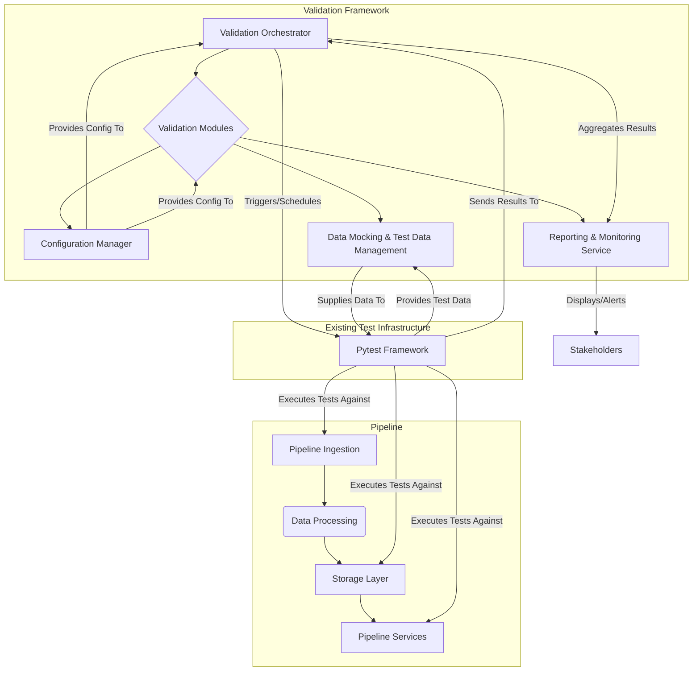

# End-to-End Pipeline Validation Architecture

## 1. Overview

This document outlines the architecture for a comprehensive end-to-end pipeline validation framework. The goal is to ensure data integrity, system reliability, performance, and security across all pipeline stages through automated and real-time validation.

## 2. Core Architecture Requirements

*   **Modular Validation Framework**: Support 7 validation domains (data flow, error handling, performance, integration, security, monitoring, output verification).
*   **Scalable Test Orchestration**: Handle 1000+ test scenarios across multiple pipeline stages.
*   **Real-time Monitoring**: Live validation dashboards and alerting.
*   **Extensible Plugin System**: Easy addition of new validation modules.
*   **Performance Benchmarking**: Automated performance regression detection.
*   **Security Validation**: Integrated vulnerability scanning and compliance checks.

## 3. Technical Constraints

*   Use existing test framework structure in `tests/framework/`.
*   Integrate with existing pipeline components in `pipeline/`.
*   Support `pytest`-based test execution.
*   Environment-agnostic configuration (no hard-coded variables).
*   Service boundaries must be clearly defined.
*   All components must be independently testable.

## 4. Integration Points

*   Pipeline ingestion (`pipeline/ingestion/`)
*   Storage layer (`pipeline/storage/`)
*   Services (`pipeline/services/`)
*   Existing test infrastructure (`tests/`)

## 5. System Decomposition and Component Responsibilities

### 5.1. Validation Orchestrator

*   **Responsibility**: Manages the execution of validation test suites, schedules tests, and aggregates results.
*   **Key Components**:
    *   **Test Scheduler**: Triggers validation runs based on predefined schedules or events (e.g., code deployment).
    *   **Test Runner Adapter**: Interfaces with `pytest` to execute test scenarios.
    *   **Result Aggregator**: Collects and consolidates results from various validation modules.

### 5.2. Validation Modules (Plugins)

*   **Responsibility**: Encapsulate specific validation logic for each domain. These are designed as plugins for extensibility.
*   **Validation Domains**:
    *   **Data Flow Validation**: Ensures data moves correctly between pipeline stages, verifying transformations and integrity.
    *   **Error Handling Validation**: Tests the system's resilience and error recovery mechanisms.
    *   **Performance Validation**: Benchmarks pipeline performance, identifies bottlenecks, and detects regressions.
    *   **Integration Validation**: Verifies correct interaction between pipeline components and external services.
    *   **Security Validation**: Conducts vulnerability scans, compliance checks, and access control verification.
    *   **Monitoring Validation**: Ensures monitoring systems are correctly capturing metrics and logs.
    *   **Output Verification**: Validates the final output of the pipeline against expected results.
*   **Structure**: Each module will adhere to a common interface, allowing the Validation Orchestrator to dynamically load and execute them.

### 5.3. Configuration Manager

*   **Responsibility**: Provides environment-agnostic configuration to all validation components.
*   **Key Features**: Loads configurations from various sources (e.g., environment variables, configuration files) without hard-coding sensitive information.

### 5.4. Reporting & Monitoring Service

*   **Responsibility**: Visualizes validation results, generates alerts, and provides historical data for analysis.
*   **Key Components**:
    *   **Dashboard Interface**: Presents real-time validation status and trends.
    *   **Alerting Engine**: Notifies stakeholders of critical failures or performance degradations.
    *   **Historical Data Store**: Persists validation results for auditing and long-term analysis.

### 5.5. Data Mocking & Test Data Management

*   **Responsibility**: Generates and manages test data for various validation scenarios.
*   **Key Features**: Supports synthetic data generation, data anonymization, and scenario-specific data provisioning.

## 6. Data Flow Diagram

## 7. Integration Specifications

### 7.1. Integration with Pipeline Components

*   **Mechanism**: Validation modules will interact with pipeline components (Ingestion, Storage, Services) primarily through their defined APIs and interfaces.
*   **Pytest Fixtures**: Leverage `pytest` fixtures to set up and tear down pipeline components for isolated testing.
*   **Example (Data Flow Validation)**: A data flow validation module might ingest a known dataset via `pipeline/ingestion/`, then query `pipeline/storage/` to verify data persistence and integrity.

### 7.2. Integration with Existing Test Framework (`tests/framework/`)

*   **Test Runner Adapter**: The Validation Orchestrator will use a `Test Runner Adapter` to invoke `pytest` for executing validation scenarios.
*   **Shared Utilities**: Utilize existing utilities within `tests/framework/config.py`, `tests/framework/data_manager.py`, and `tests/framework/test_runner.py` for common testing functionalities.
*   **Validation Engine**: Extend or integrate with `tests/framework/validation_engine.py` to incorporate the new modular validation capabilities.

### 7.3. Extensible Plugin System

*   **Interface Definition**: Define a clear Python interface (e.g., an abstract base class) that all validation modules must implement.
*   **Dynamic Loading**: The Validation Orchestrator will dynamically discover and load validation modules from a designated directory (e.g., `tests/validation_modules/`).
*   **Configuration**: Each plugin can have its own configuration, managed by the `Configuration Manager`.

## 8. Performance Benchmarking

*   **Automated Regression Detection**: Integrate performance tests as part of the `Performance Validation` module.
*   **Baselines**: Establish performance baselines for key pipeline operations.
*   **Comparison**: Automated comparison of current performance metrics against baselines, triggering alerts on significant deviations.
*   **Tools**: Utilize `pytest-benchmark` or similar tools for performance measurement.

## 9. Security Validation

*   **Integrated Scanning**: The `Security Validation` module will incorporate tools for static application security testing (SAST), dynamic application security testing (DAST), and dependency scanning.
*   **Compliance Checks**: Automated checks against predefined security policies and compliance standards.
*   **Access Control Verification**: Tests to ensure proper authentication and authorization mechanisms are in place.

## 10. Real-time Monitoring and Alerting

*   **Metrics Collection**: Validation modules will emit metrics (e.g., test pass/fail rates, execution times, error counts) to a centralized monitoring system (e.g., Prometheus).
*   **Log Aggregation**: Structured logs from validation runs will be sent to a log aggregation system (e.g., ELK stack).
*   **Dashboards**: Grafana dashboards will visualize these metrics and logs, providing real-time insights.
*   **Alerting**: Alerting rules configured in the monitoring system will trigger notifications (e.g., PagerDuty, Slack) on critical events.

## 11. Environment-Agnostic Configuration

*   **Principle**: No hard-coded secrets, API keys, or environment-specific paths.
*   **Implementation**: Use environment variables, a `.env` file (for local development), or a dedicated configuration service (for production) to manage sensitive and environment-specific settings.
*   **Python `config` module**: Leverage Python's `configparser` or `pydantic-settings` for structured configuration loading.

## 12. Independent Testability

*   **Unit Tests**: Each component (Orchestrator, individual Validation Modules, Configuration Manager) will have comprehensive unit tests.
*   **Mocking**: Use mocking frameworks (e.g., `unittest.mock`) to isolate components during testing and simulate dependencies.
*   **Integration Tests**: Dedicated integration tests will verify the interactions between components and with the actual pipeline.

## 13. Rationale and Trade-offs

*   **Modular Design**: Promotes reusability, maintainability, and parallel development of validation modules. Trade-off: Increased initial setup complexity due to interface definition and plugin loading.
*   **Pytest Integration**: Leverages an existing, robust, and widely adopted testing framework. Trade-off: Requires adherence to `pytest` conventions.
*   **Separate Reporting Service**: Decouples validation execution from reporting, allowing for flexible visualization and alerting tools. Trade-off: Adds another service to manage.
*   **Data Mocking**: Ensures repeatable and isolated tests without relying on live data. Trade-off: Requires effort to create and maintain realistic test data.

## 14. Future Considerations

*   **AI-driven Anomaly Detection**: Integrate AI/ML models to detect subtle anomalies in pipeline behavior that traditional rules might miss.
*   **Chaos Engineering Integration**: Introduce controlled failures to test system resilience under adverse conditions.
*   **Automated Test Case Generation**: Explore generating test scenarios automatically based on pipeline changes or data patterns.