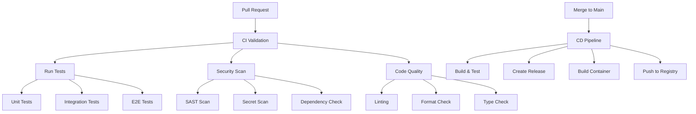

# CI/CD Workflows Documentation

## Overview

This directory contains comprehensive CI/CD workflow documentation and templates for the Agentic Startup Studio. Due to GitHub App permission limitations, workflows must be manually created from the templates provided here.

## Workflow Architecture



## Workflow Templates

### 1. CI Pipeline (`ci.yml`)
- **Trigger**: Pull requests to main/master
- **Purpose**: Validate code quality, run tests, security scans
- **Duration**: ~10-15 minutes
- **Required Checks**: All must pass for merge

### 2. CD Pipeline (`cd.yml`)
- **Trigger**: Push to main/master branch
- **Purpose**: Build, test, and deploy to production
- **Duration**: ~20-30 minutes
- **Artifacts**: Docker images, SBOM, release notes

### 3. Dependency Updates (`dependency-update.yml`)
- **Trigger**: Weekly schedule
- **Purpose**: Automated dependency updates
- **Duration**: ~5-10 minutes
- **Actions**: Create PRs for dependency updates

### 4. Security Scanning (`security-scan.yml`)
- **Trigger**: Daily schedule + PR triggers
- **Purpose**: Comprehensive security scanning
- **Duration**: ~15-20 minutes
- **Reports**: Security findings and SBOM

### 5. Performance Testing (`performance.yml`)
- **Trigger**: Manual dispatch + release tags
- **Purpose**: Load testing and performance validation
- **Duration**: ~30-45 minutes
- **Metrics**: Response times, throughput, resource usage

## Manual Setup Instructions

### Step 1: Create Workflow Directory
```bash
mkdir -p .github/workflows
```

### Step 2: Copy Workflow Templates
```bash
# Copy all workflow templates
cp docs/workflows/examples/*.yml .github/workflows/

# Or copy individual workflows
cp docs/workflows/examples/ci.yml .github/workflows/
cp docs/workflows/examples/cd.yml .github/workflows/
```

### Step 3: Configure Secrets
Add the following secrets in GitHub Settings > Secrets and variables > Actions:

#### Required Secrets
```bash
# Docker Registry
DOCKER_REGISTRY_URL=your-registry-url
DOCKER_REGISTRY_USERNAME=your-username
DOCKER_REGISTRY_PASSWORD=your-password

# Cloud Providers (if using)
AWS_ACCESS_KEY_ID=your-aws-key
AWS_SECRET_ACCESS_KEY=your-aws-secret
GOOGLE_CLOUD_KEY=your-gcp-service-account-key

# Notifications
SLACK_WEBHOOK_URL=your-slack-webhook
TEAMS_WEBHOOK_URL=your-teams-webhook

# Security
SNYK_TOKEN=your-snyk-token
SONAR_TOKEN=your-sonar-token
```

#### Optional Secrets
```bash
# Deployment
KUBERNETES_CONFIG=your-k8s-config
STAGING_URL=your-staging-url
PRODUCTION_URL=your-production-url

# External Services
SENTRY_DSN=your-sentry-dsn
NEW_RELIC_LICENSE_KEY=your-newrelic-key
```

### Step 4: Configure Environment Variables
Add environment variables in `.github/workflows/env.yml`:

```yaml
env:
  PYTHON_VERSION: "3.11"
  NODE_VERSION: "18"
  DOCKER_BUILDKIT: 1
  REGISTRY: ghcr.io
  IMAGE_NAME: ${{ github.repository }}
```

### Step 5: Enable Branch Protection
Configure branch protection rules in GitHub Settings > Branches:

- Require pull request reviews: ✅
- Require status checks: ✅
  - `ci / test-suite`
  - `ci / security-scan`
  - `ci / code-quality`
- Require branches to be up to date: ✅
- Include administrators: ✅
- Allow force pushes: ❌
- Allow deletions: ❌

## Workflow Configuration

### CI Pipeline Configuration

The CI pipeline includes multiple parallel jobs for efficiency:

```yaml
jobs:
  code-quality:    # Linting, formatting, type checking
  unit-tests:      # Fast unit tests with coverage
  integration:     # Integration tests
  security:        # Security scanning
  dependency:      # Dependency vulnerability check
```

### CD Pipeline Configuration

The CD pipeline handles production deployment:

```yaml
jobs:
  build-test:      # Build and test application
  security-scan:   # Security validation
  build-container: # Docker image build
  deploy-staging:  # Deploy to staging
  e2e-tests:       # End-to-end validation
  deploy-prod:     # Production deployment
```

### Environment-Specific Deployments

Configure different environments:

```yaml
environments:
  staging:
    url: https://staging.your-domain.com
    protection_rules:
      - type: required_reviewers
        reviewers: ["team-leads"]
  
  production:
    url: https://your-domain.com
    protection_rules:
      - type: required_reviewers
        reviewers: ["team-leads", "security-team"]
      - type: wait_timer
        minutes: 30
```

## Security Best Practices

### 1. Secret Management
- Use GitHub Secrets for sensitive data
- Rotate secrets regularly
- Use least-privilege access
- Never commit secrets to repository

### 2. Dependency Security
- Automated dependency updates
- Vulnerability scanning
- License compliance checking
- Supply chain security (SBOM)

### 3. Container Security
- Multi-stage builds for minimal images
- Non-root user execution
- Vulnerability scanning
- Image signing and verification

### 4. Access Control
- Required reviews for sensitive changes
- Status checks for all PRs
- Protected branches
- Audit logging

## Performance Optimization

### 1. Caching Strategy
```yaml
- name: Cache Dependencies
  uses: actions/cache@v3
  with:
    path: |
      ~/.cache/pip
      node_modules
      ~/.npm
    key: ${{ runner.os }}-deps-${{ hashFiles('**/requirements.txt', '**/package-lock.json') }}
```

### 2. Parallel Job Execution
```yaml
strategy:
  matrix:
    python-version: [3.11]
    test-group: [unit, integration, e2e]
  max-parallel: 3
```

### 3. Conditional Execution
```yaml
- name: Run Tests
  if: github.event_name == 'pull_request' || contains(github.event.head_commit.message, '[test]')
```

## Monitoring and Observability

### 1. Workflow Metrics
- Success/failure rates
- Duration trends
- Resource utilization
- Cost tracking

### 2. Deployment Metrics
- Deployment frequency
- Lead time for changes
- Mean time to recovery
- Change failure rate

### 3. Alerting
```yaml
- name: Notify on Failure
  if: failure()
  uses: 8398a7/action-slack@v3
  with:
    status: failure
    webhook_url: ${{ secrets.SLACK_WEBHOOK_URL }}
```

## Troubleshooting

### Common Issues

#### 1. Permission Denied
```bash
# Check repository permissions
# Ensure GitHub App has necessary permissions:
# - Actions: Read/Write
# - Contents: Read/Write
# - Pull Requests: Read/Write
# - Packages: Read/Write
```

#### 2. Secret Not Found
```bash
# Verify secret exists in repository settings
# Check secret name matches exactly (case-sensitive)
# Ensure secret is available to the environment
```

#### 3. Test Failures
```bash
# Check test isolation
# Verify environment setup
# Review test data and fixtures
# Check for race conditions
```

#### 4. Build Timeouts
```bash
# Optimize Docker builds with multi-stage
# Use build caching
# Parallelize build steps
# Increase timeout limits if necessary
```

### Debug Workflows

Enable debug logging:
```yaml
env:
  ACTIONS_STEP_DEBUG: true
  ACTIONS_RUNNER_DEBUG: true
```

## Workflow Customization

### Custom Actions

Create reusable custom actions:

```yaml
# .github/actions/setup-python/action.yml
name: 'Setup Python Environment'
description: 'Setup Python with dependencies and caching'
inputs:
  python-version:
    description: 'Python version'
    required: false
    default: '3.11'
runs:
  using: 'composite'
  steps:
    - name: Setup Python
      uses: actions/setup-python@v4
      with:
        python-version: ${{ inputs.python-version }}
    - name: Cache Dependencies
      uses: actions/cache@v3
      # ... cache configuration
```

### Workflow Templates

Create repository templates:
```yaml
# .github/workflow-templates/ci.yml
name: CI Template
description: Standard CI pipeline for Python projects
```

## Compliance and Auditing

### 1. SOC 2 Compliance
- Audit logging for all deployments
- Change management documentation
- Access control verification
- Data encryption in transit and at rest

### 2. SLSA Compliance
- Provenance generation
- Supply chain security
- Reproducible builds
- Attestation verification

### 3. Documentation Requirements
- Workflow documentation
- Change logs
- Security assessments
- Performance reports

## Migration Guide

### From Jenkins
1. Convert Jenkinsfile to GitHub Actions
2. Migrate build scripts
3. Update notification configurations
4. Test workflow equivalence

### From GitLab CI
1. Convert .gitlab-ci.yml to GitHub Actions
2. Migrate pipeline stages
3. Update environment configurations
4. Verify feature parity

### From CircleCI
1. Convert .circleci/config.yml
2. Migrate orbs to actions
3. Update workflow triggers
4. Test deployment pipelines

## Cost Optimization

### 1. Resource Management
- Use appropriate runner sizes
- Optimize job duration
- Implement smart caching
- Use conditional execution

### 2. Billing Monitoring
- Track GitHub Actions usage
- Monitor runner costs
- Optimize workflow efficiency
- Set up cost alerts

### 3. Runner Selection
```yaml
runs-on: ubuntu-latest  # Free for public repos
# vs
runs-on: ubuntu-20.04   # Specific version if needed
# vs
runs-on: self-hosted    # For private repos with high usage
```

## Support and Resources

### Documentation Links
- [GitHub Actions Documentation](https://docs.github.com/en/actions)
- [Workflow Syntax](https://docs.github.com/en/actions/using-workflows/workflow-syntax-for-github-actions)
- [Security Best Practices](https://docs.github.com/en/actions/security-guides)

### Community Resources
- [GitHub Actions Marketplace](https://github.com/marketplace?type=actions)
- [Awesome Actions](https://github.com/sdras/awesome-actions)
- [Community Forums](https://github.com/community)

### Support Channels
- GitHub Support for enterprise customers
- Community discussions
- Stack Overflow for technical questions
- Repository maintainer documentation