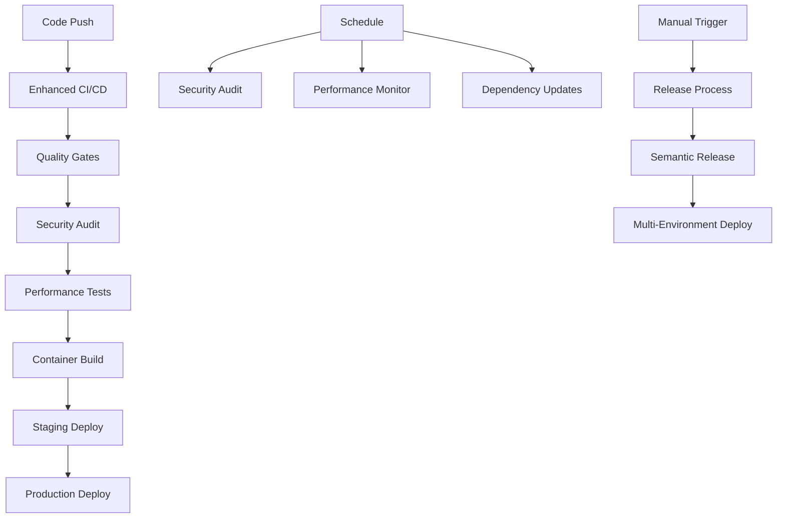

# Workflow Integration Guide

This guide provides comprehensive instructions for integrating and managing the advanced GitHub Actions workflows implemented in this repository.

## Workflow Architecture

### Overview
The repository implements a sophisticated multi-stage workflow architecture designed for enterprise-grade SDLC practices:



## Workflow Components

### 1. Enhanced CI/CD Pipeline (`ci-enhanced.yml`)

**Purpose**: Comprehensive continuous integration with advanced quality gates

**Triggers**:
- Push to `main`, `dev`, `feature/*` branches
- Pull requests to `main`, `dev`
- Manual workflow dispatch with environment selection

**Key Features**:
- Parallel test execution (unit, integration, e2e)
- Multi-stage quality validation
- Container security scanning
- Performance benchmarking
- Automated deployment to staging/production

**Usage**:
```yaml
# Manual trigger with specific environment
on:
  workflow_dispatch:
    inputs:
      environment:
        description: 'Target environment'
        type: choice
        options: [staging, production]
```

### 2. Security Audit Pipeline (`security-audit.yml`)

**Purpose**: Comprehensive security validation and compliance

**Triggers**:
- Daily schedule (2 AM UTC)
- Changes to dependencies (`requirements.txt`, `pyproject.toml`)
- Manual workflow dispatch

**Components**:
- **Vulnerability Assessment**: Safety, Bandit, Semgrep scanning
- **Secrets Detection**: TruffleHog, detect-secrets
- **License Compliance**: Automated license validation
- **SBOM Generation**: Software Bill of Materials creation

**Integration Points**:
```yaml
# Automatic security gate in main CI
needs: [code-quality, test-matrix, container-security]
if: always()
```

### 3. Performance Monitoring (`performance-monitoring.yml`)

**Purpose**: Continuous performance validation and regression detection

**Triggers**:
- Push to main branch
- Pull requests (regression analysis)
- Daily performance baseline (3 AM UTC)
- Manual benchmark execution

**Test Types**:
- **API Performance**: Response time and throughput
- **Database Performance**: Query optimization and indexing
- **Pipeline Performance**: End-to-end processing benchmarks
- **Load Testing**: Concurrent user simulation

### 4. Automated Release (`release.yml`)

**Purpose**: Semantic versioning and automated deployment

**Triggers**:
- Push to main branch (automatic release detection)
- Manual workflow dispatch with release type override

**Process Flow**:
1. Pre-release validation (tests, security, build)
2. Semantic version calculation
3. Container building and publishing
4. Staging deployment and validation
5. Production deployment (with approval)
6. Post-release notifications and archiving

### 5. Dependency Management (`dependabot.yml`)

**Purpose**: Automated dependency updates with intelligent grouping

**Schedule**:
- Python dependencies: Monday 9 AM
- GitHub Actions: Tuesday 9 AM  
- Docker images: Wednesday 9 AM

**Smart Features**:
- Grouped updates by category (testing, security, linting)
- Team-based review assignments
- Major version update protection for critical dependencies

## Integration Setup

### Prerequisites

1. **Repository Secrets**:
```bash
# Required secrets for full functionality
GITHUB_TOKEN          # Automatic (GitHub provides)
NPM_TOKEN             # For semantic-release (if publishing to npm)
STAGING_DATABASE_URL  # Staging environment database
STAGING_REDIS_URL     # Staging environment Redis
PRODUCTION_DATABASE_URL # Production environment database
PRODUCTION_REDIS_URL   # Production environment Redis
```

2. **Environment Protection Rules**:
```yaml
# .github/environments/staging.yml
name: staging
protection_rules:
  required_reviewers:
    users: ["devops-team"]
  wait_timer: 0

# .github/environments/production.yml  
name: production
protection_rules:
  required_reviewers:
    users: ["senior-engineers", "security-team"]
  wait_timer: 60  # 1 hour delay
```

3. **Branch Protection Rules**:
```json
{
  "required_status_checks": {
    "strict": true,
    "contexts": [
      "Code Quality & Security",
      "Test Suite (unit)",
      "Test Suite (integration)", 
      "Test Suite (e2e)",
      "Container Security"
    ]
  },
  "required_pull_request_reviews": {
    "required_approving_review_count": 2,
    "dismiss_stale_reviews": true,
    "require_code_owner_reviews": true
  },
  "enforce_admins": false,
  "restrictions": null
}
```

### Team Configuration

1. **CODEOWNERS File**:
```bash
# .github/CODEOWNERS
# Global ownership
* @terragon-labs/core-team

# Workflow and CI/CD
.github/workflows/ @terragon-labs/devops-team
.github/dependabot.yml @terragon-labs/security-team

# Security and compliance
scripts/validate_*.py @terragon-labs/security-team
**/security-*.yml @terragon-labs/security-team

# Performance and monitoring
**/performance-*.yml @terragon-labs/platform-team
scripts/performance_*.py @terragon-labs/platform-team

# Documentation
docs/ @terragon-labs/documentation-team
*.md @terragon-labs/documentation-team
```

2. **Team Assignments**:
```yaml
# In dependabot.yml
reviewers:
  - "terragon-labs/core-team"
assignees:
  - "terragon-labs/security-team"
```

## Workflow Customization

### Environment Variables

Create environment-specific configurations:

```yaml
# For staging environment
env:
  ENVIRONMENT: staging
  LOG_LEVEL: DEBUG
  PERFORMANCE_THRESHOLD_MS: 500
  SECURITY_SCAN_LEVEL: medium

# For production environment  
env:
  ENVIRONMENT: production
  LOG_LEVEL: INFO
  PERFORMANCE_THRESHOLD_MS: 200
  SECURITY_SCAN_LEVEL: high
```

### Notification Integration

Add team notifications:

```yaml
# Slack notification example
- name: Notify team on failure
  if: failure()
  uses: 8398a7/action-slack@v3
  with:
    status: failure
    channel: '#engineering'
    webhook_url: ${{ secrets.SLACK_WEBHOOK }}
```

### Custom Quality Gates

Extend quality validation:

```yaml
# Custom quality gate
- name: Custom business logic validation
  run: |
    python scripts/validate_business_rules.py
    if [ $? -ne 0 ]; then
      echo "❌ Business logic validation failed"
      exit 1
    fi
```

## Monitoring and Observability

### Workflow Metrics

Track workflow performance:

```bash
# Get workflow run statistics
gh api repos/:owner/:repo/actions/workflows \
  --jq '.workflows[] | {name: .name, runs: .badge_url}'

# Monitor workflow success rates
gh api repos/:owner/:repo/actions/runs \
  --jq '.workflow_runs | group_by(.workflow_id) | 
        map({workflow: .[0].name, 
             success_rate: (map(select(.conclusion == "success")) | length) / length})'
```

### Performance Tracking

Monitor build and test performance:

```yaml
# Add performance tracking
- name: Track build performance
  run: |
    echo "BUILD_START=$(date +%s)" >> $GITHUB_ENV
    
# At end of job
- name: Report build duration
  run: |
    BUILD_END=$(date +%s)
    DURATION=$((BUILD_END - BUILD_START))
    echo "Build completed in ${DURATION} seconds"
    
    # Store in metrics (example with custom endpoint)
    curl -X POST ${{ secrets.METRICS_ENDPOINT }} \
      -H "Content-Type: application/json" \
      -d '{"workflow": "${{ github.workflow }}", "duration": '${DURATION}'}'
```

### Alert Configuration

Set up alerts for workflow failures:

```yaml
# Alert on repeated failures
- name: Check failure count
  if: failure()
  run: |
    FAILURES=$(gh api repos/:owner/:repo/actions/runs \
      --jq '.workflow_runs | map(select(.name == "${{ github.workflow }}" and .conclusion == "failure")) | length')
    
    if [ $FAILURES -gt 3 ]; then
      echo "❌ Workflow has failed $FAILURES times recently"
      # Send alert to incident management system
      curl -X POST ${{ secrets.INCIDENT_WEBHOOK }} \
        -d '{"alert": "Workflow failure threshold exceeded", "workflow": "${{ github.workflow }}"}'
    fi
```

## Troubleshooting

### Common Issues

**1. Workflow Permission Errors**:
```yaml
# Ensure proper permissions
permissions:
  contents: write    # For semantic-release
  packages: write    # For container publishing  
  issues: write      # For creating issues
  pull-requests: write # For PR comments
```

**2. Environment Access Issues**:
```bash
# Verify environment protection rules
gh api repos/:owner/:repo/environments

# Check team memberships
gh api orgs/:org/teams/:team/members
```

**3. Secret Access Problems**:
```bash
# List available secrets
gh secret list

# Check secret usage in workflow
gh api repos/:owner/:repo/actions/secrets
```

**4. Dependency Update Conflicts**:
```yaml
# Handle conflicting dependency updates
- name: Resolve dependency conflicts
  run: |
    pip-compile requirements.in --upgrade
    pip-compile requirements-dev.in --upgrade
    
    # Check for conflicts
    pip check || (echo "Dependency conflicts detected" && exit 1)
```

### Debugging Workflows

**1. Enable Debug Logging**:
```bash
# Set repository variables for debug mode
gh variable set ACTIONS_RUNNER_DEBUG --body "true"
gh variable set ACTIONS_STEP_DEBUG --body "true"
```

**2. Workflow Run Analysis**:
```bash
# Get detailed run information
gh run view <run-id> --log

# Download all artifacts for investigation
gh run download <run-id>
```

**3. Local Workflow Testing**:
```bash
# Use act to test workflows locally
act -W .github/workflows/ci-enhanced.yml \
    -s GITHUB_TOKEN=$GITHUB_TOKEN \
    --artifact-server-path ./artifacts
```

## Best Practices

### 1. Workflow Design
- **Fail fast**: Run quick checks before expensive operations
- **Parallel execution**: Use job dependencies efficiently  
- **Resource limits**: Set appropriate timeouts and limits
- **Artifact management**: Clean up artifacts regularly

### 2. Security Considerations
- **Secret management**: Use environment-specific secrets
- **Permission minimization**: Grant least required permissions
- **Audit logging**: Track all workflow executions
- **Vulnerability scanning**: Regular security updates

### 3. Performance Optimization
- **Caching strategies**: Cache dependencies and build artifacts
- **Matrix optimization**: Balance parallelism with resource usage
- **Conditional execution**: Skip unnecessary jobs based on changes
- **Resource monitoring**: Track workflow resource consumption

### 4. Maintenance
- **Regular updates**: Keep actions and dependencies current
- **Documentation**: Maintain up-to-date workflow documentation
- **Testing**: Validate workflow changes in staging
- **Monitoring**: Set up alerts for workflow health

This integration guide ensures your team can effectively manage and extend the advanced workflow infrastructure for optimal development velocity and quality assurance.